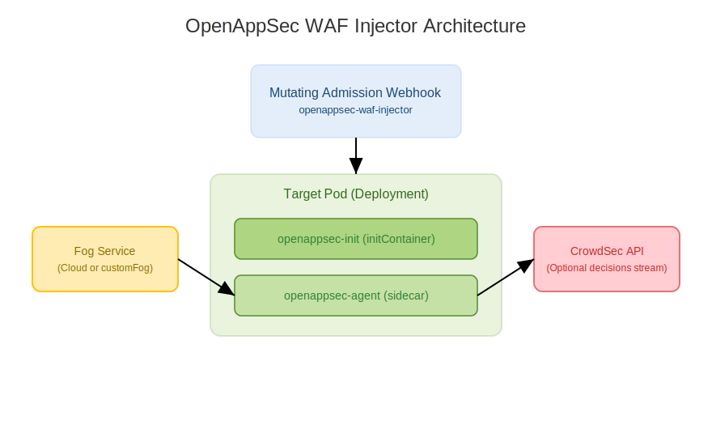

# OpenAppSec WAF Injector – Helm Chart for Kubernetes

<div align=center>
 
</div>

A Kubernetes Helm chart for deploying the OpenAppSec WAF Injector, which automatically injects the OpenAppSec security agent into pods using a Mutating Admission Webhook.
This chart manages:

- Webhook deployment & TLS certificates
- WAF configuration injection
- Optional CrowdSec integration
- Optional custom Fog endpoint
- RBAC, service, and ConfigMaps
- CRDs (if enabled)

> [!NOTE]
> This repository was inspired by [open-appsec-injector](https://charts.openappsec.io)

## Architecture Overview


## Prerequisites
- Kubernetes 1.24+
- Helm 3.10.0+
- Istio Gateway <=1.26.6
- Envoy Proxy <=1.34.10

## Installing the Chart
Add repo (example)
To install the chart with the release name `open-appsec-injector` on `istio-ingress` namespace:

```bash
helm repo add startechnica https://startechnica.github.io/apps
helm repo update

helm install open-appsec-injector startechnica/open-appsec-injector \
  --set kind=istio
  --set agent.userEmail=<your-email-address> \
  --set agent.agentToken=<agent-token-from-UI> \
  --namespace istio-ingress \
  --create-namespace
```

Install with cert-manager Webhook TLS auto-injection
```bash
helm install open-appsec-injector startechnica/open-appsec-injector \
  --set webhook.tls.useCertManager=true
```

> **Tip**: List all releases using `helm list -A`

## Enable open-appsec Injection to the existing deployment
To allow open-appsec to inspect the traffic through your existing Istio Ingress or Kong gateway, it must be attached to the existing deployment. This happens automatically if the proper labels are set and the deployment is restarted.

1. Label the Namespace -- Add the inject-waf-attachment=true label to the namespace of your existing reverse proxy deployment (e.g. Istio Ingress Gateway or Kong):
```bash
kubectl label namespace istio-ingress inject-waf-attachment="true" --overwrite
```
2. Label the Deployment -- Ensure your current reverse proxy deployment has the required labels set as configured in your webhook.objectSelector:
```yaml
agent:
  objectSelector:
    matchLabels:
      gateway.networking.k8s.io/gateway-name: istio-ingress
```
(These labels must match what’s configured in the open-appsec Helm chart. Refer to your Helm values or the section above for details.)
3. Restart the existing reverse proxy deployment -- Restart your existing deployment by using the following command:
```bash
kubectl rollout restart deployment istio-ingress -n istio-ingress
```

## Uninstalling the Chart

To uninstall/delete the `open-appsec-injector` deployment:

```console
helm delete open-appsec-injector --namespace istio-ingress
```

The command removes all the Kubernetes components associated with the chart and deletes the release.

## CrowdSec Integration (Optional)
OpenAppSec can consult CrowdSec for malicious IP decisions.

```yaml
crowdSec:
  enabled: true
  mode: prevent
  logging: enabled
  api:
    url: http://crowdsec-service:8080/v1/decisions/stream
  auth:
    method: apikey
    data: "00000000000000000000000000000000"
```

## Custom Fog Endpoint (Optional)
Use this when connecting to a dedicated Fog service.
```yaml
customFog:
  enabled: true
  fogAddress: "https://inext-agents.cloud.ngen.checkpoint.com/"
```
If disabled, the agent will use OpenAppSec default cloud endpoints.

## 🔧 Examples
Install with custom Fog & CrowdSec enabled
```bash
helm install open-appsec-injector startechnica/open-appsec-injector \
  --set customFog.enabled=true \
  --set customFog.fogAddress="https://inext-agents.cloud.ngen.checkpoint.com" \
  --set crowdSec.enabled=true \
  --set crowdSec.auth.data="myapikey"
```

Disable webhook TLS (not recommended)
```bash
helm install open-appsec-injector startechnica/open-appsec-injector \
  --set webhook.tls.useCertManager=false
```

## 🧪 Testing
Render templates:
```bash
helm template ./open-appsec-injector
```

Test webhook health:
```bash
kubectl get validatingwebhookconfiguration
kubectl get mutatingwebhookconfiguration
```

## ❗ Troubleshooting
### ❌ Webhook TLS error: "x509: certificate signed by unknown authority"
Cause: The webhook CA bundle in the MutatingWebhookConfiguration is incorrect.

Fix:
- If using cert-manager → ensure Certificate is ready
- Or recreate secret + restart pods
- Or to remove mutatingwebhookconfiguration, run:
```bash
kubectl delete mutatingwebhookconfiguration open-appsec-injector
```

## ⚙️ Parameters

### Global parameters

| Name                           | Description                                                                                                             | Value |
| -------------------------      | ----------------------------------------------------------------------------------------------------------------------- | ----- |
| `global.imageRegistry`         | Global Docker image registry                                                                                            | `""`  |
| `global.imagePullSecrets`      | Global Docker registry secret names as an array                                                                         | `[]`  |
| `global.defaultStorageClass`   | Global StorageClass for Persistent Volume(s)                                                                            | `""`  |
| `global.compatibility.openshift.adaptSecurityContext` | Adapt the securityContext sections of the deployment to make them compatible with Openshift restricted-v2 SCC: remove runAsUser, runAsGroup and fsGroup and let the platform use their allowed default IDs. Possible values: auto (apply if the detected running cluster is Openshift), force (perform the adaptation always), disabled (do not perform adaptation) | `auto`  |


### Common parameters

| Name                       | Description                                                                                                       | Value           |
| -------------------------- | ----------------------------------------------------------------------------------------------------------------- | --------------- |
| `kubeVersion`              | Force target Kubernetes version (using Helm capabilities if not set)                                              | `""`            |
| `nameOverride`             | String to partially override st-common.names.fullname template with a string (will prepend the release name)      | `""`            |
| `namespaceOverride`        | String to fully override st-common.names.namespace                                                                | `""`            |
| `fullnameOverride`         | String to fully override st-common.names.fullname template with a string                                          | `""`            |
| `commonAnnotations`        | Annotations to add to all deployed objects                                                                        | `{}`            |
| `commonLabels`             | Labels to add to all deployed objects                                                                             | `{}`            |
| `schedulerName`            | Name of the Kubernetes scheduler (other than default)                                                             | `""`            |
| `clusterDomain`            | Kubernetes DNS Domain name to use                                                                                 | `cluster.local` |
| `extraDeploy`              | Array of extra objects to deploy with the release (evaluated as a template)                                       | `[]`            |
| `diagnosticMode.enabled`   | Enable diagnostic mode (all probes will be disabled and the command will be overridden)                           | `false`         |
| `diagnosticMode.command`   | Command to override all containers in the deployment                                                              | `[]`            |
| `diagnosticMode.args`      | Args to override all containers in the deployment                                                                 | `[]`            |

## License

Copyright &copy; 2025 Startechnica

Licensed under the Apache License, Version 2.0 (the "License");
you may not use this file except in compliance with the License.
You may obtain a copy of the License at

    http://www.apache.org/licenses/LICENSE-2.0

Unless required by applicable law or agreed to in writing, software
distributed under the License is distributed on an "AS IS" BASIS,
WITHOUT WARRANTIES OR CONDITIONS OF ANY KIND, either express or implied.
See the License for the specific language governing permissions and
limitations under the License.
