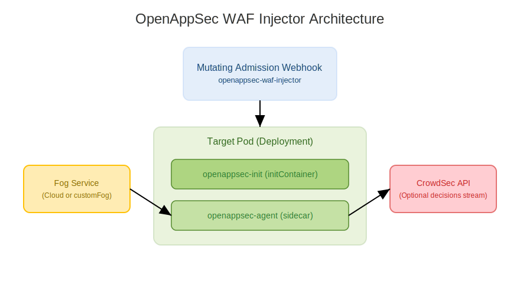

# OpenAppSec WAF Injector – Helm Chart for Kubernetes

<div align=center>
 
</div>

A Kubernetes Helm chart for deploying the OpenAppSec WAF Injector, which automatically injects the OpenAppSec security agent into pods using a Mutating Admission Webhook.

This chart manages:

- Mutating admission webhook (Deployment + Service + MWC + RBAC) — the active path that injects the agent sidecar on pod creation.
- Optional learning / storage / tuning data-plane components — internal services the injected agents talk to.
- Optional CrowdSec integration for threat-IP feed consumption.
- Optional custom Fog (Check Point Infinity) endpoint override.
- Per-component NetworkPolicies (opt-in via `<component>.networkPolicy.enabled`).
- Optional PodDisruptionBudget for the webhook (`webhook.pdb.enabled`).
- Pre-built default policy presets (`defaultConfigurations.mode = detect-learn | prevent-learn | prevent`) for both cluster-scoped and namespaced CRD flavors.

CRDs are shipped by the sister chart [`open-appsec-crd`](https://github.com/startechnica/apps/tree/main/charts/open-appsec-crd) and bundled with this chart by default (`crds.enabled=true`). Set `crds.enabled=false` if you'd rather manage the schema lifecycle separately via `helm install open-appsec-crd startechnica/open-appsec-crd`.

> [!NOTE]
> This repository was inspired by [open-appsec-injector](https://charts.openappsec.io)

## Architecture Overview


## Prerequisites
- Kubernetes 1.25+ (per `Chart.yaml` `kubeVersion`)
- Helm 3.10.0+
- An Istio Gateway deployment to attach the agent to (see [Tested versions](#tested-versions) below for the exact Istio/Envoy matrix this chart has been validated against).
- CRDs from the sister chart `open-appsec-crd`. Bundled by default (`crds.enabled=true`); set `crds.enabled=false` if you'd rather manage the schema lifecycle separately via `helm install open-appsec-crd startechnica/open-appsec-crd`.

### Tested versions
This chart has been validated against the following Istio releases:

| Component | Versions verified |
| --- | --- |
| Istio Gateway | 1.26.8, 1.27.9, 1.28.6 |

Other Istio versions in the same minor lines are expected to work but have
not been exercised end-to-end — file an issue if you hit a regression on a
build outside this matrix.

### Why these versions matter (compatibility chain)

The open-appsec runtime is bound to a specific Istio range, and that range
is governed by the version of Envoy that Istio ships. The dependency chain
is one-way:

```
open-appsec app version (Chart.yaml appVersion)
     │
     ▼  attaches at runtime via webhook.istioIngressGatewayAttachmentLibrary
     │  (a native .so that the Istio proxy dlopen()s)
     ▼
Envoy proxy build embedded in the Istio gateway
     │
     ▼  is shipped as part of
     ▼
Istio release line (1.26.x / 1.27.x / 1.28.x …)
```

What that means in practice:

1. **The attachment library is compiled against a specific Envoy ABI.**
   Each open-appsec image release (`appVersion: 1.1.34` here) ships a
   `/usr/lib/attachment` `.so` that targets a particular Envoy SDK
   version. Loading that `.so` into an Envoy build with an incompatible
   ABI either silently misbehaves or crashes the proxy on first request.

2. **Envoy is part of Istio, not a separate dial.** You don't pick the
   Envoy version on an Istio install; Istio bakes one in. Upgrading
   Istio implicitly upgrades Envoy, which implicitly changes the ABI
   the attachment sees.

3. **So the verified Istio matrix above defines the supported Envoy range
   for this `appVersion`, and the `appVersion` is what determines which
   Istio range is supported.** Upgrading any one of the three without
   verifying the other two is how you get hard-to-diagnose admission
   failures or proxy crashes after a rolling restart.

Upgrade rule of thumb: bump the chart's `appVersion` and the Istio release
together, and keep a staging environment one step ahead of production so
ABI surprises surface before they reach load.

## Installing the Chart

Add the repo:

```bash
helm repo add startechnica https://startechnica.github.io/apps
helm repo update
```

### Default — bundled CRDs (one-shot)

The injector chart pulls in `open-appsec-crd` as a subchart by default. One command installs both the schema and the application:

```bash
helm install open-appsec-injector startechnica/open-appsec-injector \
  --set kind=istio \
  --set agent.userEmail=<your-email-address> \
  --set agent.agentToken=<agent-token-from-UI> \
  --namespace istio-ingress \
  --create-namespace
```

### Advanced — decoupled CRD lifecycle

If multiple injector releases will share one set of CRDs, or you want to upgrade the schema independently of the application, install the sister chart once cluster-wide and disable the bundled subchart on each injector release:

```bash
# Step 1 — one-time cluster-wide
helm install open-appsec-crd startechnica/open-appsec-crd

# Step 2 — each injector release
helm install open-appsec-injector startechnica/open-appsec-injector \
  --set crds.enabled=false \
  --set kind=istio \
  --set agent.userEmail=<your-email-address> \
  --set agent.agentToken=<agent-token-from-UI> \
  --namespace istio-ingress \
  --create-namespace
```

The CRDs carry `helm.sh/resource-policy: keep` either way, so they survive `helm uninstall`.

> **Tip**: List all releases using `helm list -A`.

## Enable open-appsec Injection to the existing deployment
To allow open-appsec to inspect the traffic through your existing Istio Ingress or Kong gateway, it must be attached to the existing deployment. This happens automatically if the proper labels are set and the deployment is restarted.

1. Label the Namespace -- Add the inject-waf-attachment=true label to the namespace of your existing reverse proxy deployment (e.g. Istio Ingress Gateway or Kong):
```bash
kubectl label namespace istio-ingress inject-waf-attachment="true" --overwrite
```
2. Label the Deployment -- Ensure your current reverse proxy deployment has the required labels set as configured in `agent.objectSelector`:
```yaml
agent:
  objectSelector:
    matchLabels:
      gateway.networking.k8s.io/gateway-name: istio-ingress
```
(These labels must match what’s configured in the open-appsec Helm chart. Refer to your Helm values or the section above for details.)

3. Restart the existing reverse proxy deployment -- Restart your existing deployment by using the following command:
```bash
kubectl rollout restart deployment istio-ingress -n istio-ingress
```

## Uninstalling the Chart

To uninstall/delete the `open-appsec-injector` deployment:

```console
helm delete open-appsec-injector --namespace istio-ingress
```

The command removes all the Kubernetes components associated with the chart and deletes the release.

## CrowdSec Integration (Optional)
OpenAppSec can consult CrowdSec for malicious IP decisions.

```yaml
crowdSec:
  enabled: true
  mode: prevent
  logging: enabled
  api:
    url: http://crowdsec-service:8080/v1/decisions/stream
  auth:
    method: apikey
    data: "00000000000000000000000000000000"
```

## Custom Fog Endpoint (Optional)
Use this when connecting to a dedicated Fog service.
```yaml
customFog:
  enabled: true
  fogAddress: "https://inext-agents.cloud.ngen.checkpoint.com/"
```
If disabled, the agent will use OpenAppSec default cloud endpoints.

## Examples

### Install with custom Fog & CrowdSec enabled

```bash
helm install open-appsec-injector startechnica/open-appsec-injector \
  --set customFog.enabled=true \
  --set customFog.fogAddress="https://inext-agents.cloud.ngen.checkpoint.com" \
  --set crowdSec.enabled=true \
  --set crowdSec.auth.data="myapikey"
```

### Install with the tuning component + external PostgreSQL

```bash
helm install open-appsec-injector startechnica/open-appsec-injector \
  --set appsec.tuning.enabled=true \
  --set appsec.tuning.externalDatabase.host=postgres.example.com \
  --set appsec.tuning.externalDatabase.existingSecret=tuning-db-creds
```

### Production posture (PDB + NetworkPolicies + tightened RBAC)

```bash
helm install open-appsec-injector startechnica/open-appsec-injector \
  --set webhook.replicaCount=2 \
  --set webhook.pdb.enabled=true \
  --set webhook.networkPolicy.enabled=true \
  --set appsec.learning.networkPolicy.enabled=true \
  --set appsec.storage.networkPolicy.enabled=true \
  --set allowedNamespaces='{istio-ingress,kong}'
```

## Testing

Render templates locally without installing:

```bash
helm template open-appsec-injector startechnica/open-appsec-injector
```

Verify the MutatingWebhookConfiguration is registered:

```bash
kubectl get mutatingwebhookconfiguration
```

## Troubleshooting

The post-install `NOTES.txt` (printed at the end of `helm install`/`helm upgrade`) carries the canonical "what to check next" walkthrough. The most common failures:

### Webhook TLS error: `x509: certificate signed by unknown authority`

The container's `secretgen.py` generates a CA at startup and PATCHes the `MutatingWebhookConfiguration`'s `caBundle` via the K8s API. If the patch failed (RBAC denied, API throttled), the MWC's caBundle stays empty and admission calls fail.

```bash
# Check whether the patch landed (default name: openappsec-waf.injector.cp)
kubectl get mutatingwebhookconfiguration <webhook-name> \
  -o jsonpath='{.webhooks[0].clientConfig.caBundle}' | head -c 32

# If empty, inspect the webhook pod logs for cert-gen errors
kubectl logs deployment/<webhook-fullname> -n <release-ns>

# Last resort — delete the MWC and let helm re-create it on next upgrade
kubectl delete mutatingwebhookconfiguration <webhook-name>
```

### `MountVolume.SetUp failed` on agent pods

`agent.persistence` is enabled but no PV is available. Either set `agent.persistence.config.storageClass` / `agent.persistence.data.storageClass` to a class that has a provisioner, or supply `agent.persistence.{config,data}.existingClaim` pointing at pre-created PVCs.

### Tuning pod in `CrashLoopBackOff`

`appsec.tuning.enabled=true` but no database is configured. Either enable the bundled subchart with `--set postgresql.enabled=true`, or point at an external PostgreSQL via `appsec.tuning.externalDatabase.host` and `appsec.tuning.externalDatabase.existingSecret`. Templates will fail-fast at render time if neither path is configured.

## Parameters

### Global parameters

| Name                                                  | Description                                                                                                                                                                                                                                                                                                                                                         | Value     |
| ----------------------------------------------------- | ------------------------------------------------------------------------------------------------------------------------------------------------------------------------------------------------------------------------------------------------------------------------------------------------------------------------------------------------------------------- | --------- |
| `global.imageRegistry`                                | Global Docker image registry                                                                                                                                                                                                                                                                                                                                        | `""`      |
| `global.imagePullSecrets`                             | Global Docker registry secret names as an array                                                                                                                                                                                                                                                                                                                     | `[]`      |
| `global.defaultStorageClass`                          | Global default StorageClass for Persistent Volume(s)                                                                                                                                                                                                                                                                                                                | `""`      |
| `global.compatibility.openshift.adaptSecurityContext` | Adapt the securityContext sections of the deployment to make them compatible with Openshift restricted-v2 SCC: remove runAsUser, runAsGroup and fsGroup and let the platform use their allowed default IDs. Possible values: auto (apply if the detected running cluster is Openshift), force (perform the adaptation always), disabled (do not perform adaptation) | `auto`    |
| `global.compatibility.omitEmptySeLinuxOptions`        | If set to true, removes the seLinuxOptions from the securityContexts when it is set to an empty object                                                                                                                                                                                                                                                              | `false`   |
| `crds.enabled`                                        | Bundle the `open-appsec-crd` subchart with this release. Disable when CRDs are managed by a separately-installed `open-appsec-crd` chart (multiple injector releases sharing one schema, or CRD lifecycle owned by a different team).                                                                                                                               | `true`    |
| `crds.scope`                                          | CRD scope the webhook expects to consult at runtime (`cluster` or `namespaced`). Must match what was installed via the `open-appsec-crd` chart (bundled or separate). Plumbed into the webhook container as `CRDS_SCOPE`.                                                                                                                                           | `cluster` |
| `nameOverride`                                        | String to partially override app.fullname template (will maintain the release name)                                                                                                                                                                                                                                                                                 | `""`      |

### Common parameters

| Name                      | Description                                                                                               | Value           |
| ------------------------- | --------------------------------------------------------------------------------------------------------- | --------------- |
| `fullnameOverride`        | String to fully override app.fullname template                                                            | `""`            |
| `namespaceOverride`       | String to fully override common.names.namespace                                                           | `""`            |
| `kubeVersion`             | Force target Kubernetes version (using Helm capabilities if not set)                                      | `""`            |
| `dnsPolicy`               | DNS Policy for pod                                                                                        | `""`            |
| `dnsConfig`               | DNS Configuration pod                                                                                     | `{}`            |
| `clusterDomain`           | Default Kubernetes cluster domain                                                                         | `cluster.local` |
| `extraDeploy`             | Array of extra objects to deploy with the release                                                         | `[]`            |
| `commonLabels`            | Add labels to all the deployed resources (sub-charts are not considered). Evaluated as a template         | `{}`            |
| `commonAnnotations`       | Common annotations to add to all Mongo resources (sub-charts are not considered). Evaluated as a template | `{}`            |
| `deploymentAnnotations`   | Annotations to add to the deployment                                                                      | `{}`            |
| `topologyKey`             | Override common lib default topology key. If empty - "kubernetes.io/hostname" is used                     | `""`            |
| `serviceBindings.enabled` | Create secret for service binding (Experimental)                                                          | `false`         |
| `enableServiceLinks`      | Whether information about services should be injected into pod's environment variable                     | `true`          |

### Diagnostic mode

| Name                     | Description                                                                             | Value          |
| ------------------------ | --------------------------------------------------------------------------------------- | -------------- |
| `diagnosticMode.enabled` | Enable diagnostic mode (all probes will be disabled and the command will be overridden) | `false`        |
| `diagnosticMode.command` | Command to override all containers in the deployment                                    | `["sleep"]`    |
| `diagnosticMode.args`    | Args to override all containers in the deployment                                       | `["infinity"]` |
| `existingSecretName`     | Use an existing Secret instead of creating one                                          | `""`           |

### Authentication / deployment kind

| Name                 | Description                                                                                                                                                                                                                   | Value   |
| -------------------- | ----------------------------------------------------------------------------------------------------------------------------------------------------------------------------------------------------------------------------- | ------- |
| `kind`               | Target reverse proxy: istio or kong                                                                                                                                                                                           | `istio` |
| `removeWaf`          | Remove the WAF agent from previously-injected pods on uninstall                                                                                                                                                               | `false` |
| `allowedNamespaces`  | Namespaces this chart's RBAC + NetworkPolicies are scoped to. Drives both the `openappsec.io` ClusterRoleBinding subject set AND the ingress source set on every component's NetworkPolicy (when networkPolicy.enabled=true). | `[]`    |
| `playground.enabled` | Enables the AppSec “playground” mode. When set to true, the deployment exposes a sandbox/testing environment intended for demonstrations, rule testing, or                                                                    | `false` |

### Playground mode


### CrowdSec integration

| Name                   | Description                                                                                                                                              | Value                                              |
| ---------------------- | -------------------------------------------------------------------------------------------------------------------------------------------------------- | -------------------------------------------------- |
| `crowdSec.enabled`     | Enables or disables CrowdSec integration. When set to true, the application will query CrowdSec to obtain security decisions (ban, captcha, allow, etc.) | `false`                                            |
| `crowdSec.mode`        | Defines how the application behaves when CrowdSec provides a decision.                                                                                   | `prevent`                                          |
| `crowdSec.logging`     | Controls whether the CrowdSec middleware logs decisions.                                                                                                 | `enabled`                                          |
| `crowdSec.api.url`     | url for api                                                                                                                                              | `http://crowdsec-service:8080/v1/decisions/stream` |
| `crowdSec.auth.method` | Defines how the application authenticates against CrowdSec LAPI.                                                                                         | `apikey`                                           |
| `crowdSec.auth.data`   | The authentication data used by the selected auth method.                                                                                                | `00000000000000000000000000000000`                 |

### Custom Fog endpoint

| Name                   | Description                                                                                                        | Value                                             |
| ---------------------- | ------------------------------------------------------------------------------------------------------------------ | ------------------------------------------------- |
| `customFog.enabled`    | Enables use of a custom Fog service endpoint. Set to true when you need the agent to connect to a specific Fog URL | `true`                                            |
| `customFog.fogAddress` | Full HTTPS URL of the custom Fog service. Must be reachable from the agent.                                        | `https://inext-agents.cloud.ngen.checkpoint.com/` |

### Default configurations

| Name                            | Description                                                                                                                                                                                                                   | Value          |
| ------------------------------- | ----------------------------------------------------------------------------------------------------------------------------------------------------------------------------------------------------------------------------- | -------------- |
| `defaultConfigurations.enabled` | Render a baseline Policy + AccessControlPractice + ThreatPreventionPractice + CustomResponse + LogTrigger set so the agent has something to enforce on first start. Each preset lives in `templates/default-configs/<mode>/`. | `false`        |
| `defaultConfigurations.mode`    | Preset to render when `defaultConfigurations.enabled=true`. Picks a directory under `templates/default-configs/`. Options:                                                                                                    | `detect-learn` |

### Agent parameters

| Name                                     | Description                                                                                                                                                                            | Value                                              |
| ---------------------------------------- | -------------------------------------------------------------------------------------------------------------------------------------------------------------------------------------- | -------------------------------------------------- |
| `agent.cpu`                              | Container CPU request                                                                                                                                                                  | `200m`                                             |
| `agent.image.registry`                   | open-appsec Agent image registry                                                                                                                                                       | `REGISTRY_NAME`                                    |
| `agent.image.repository`                 | open-appsec Agent image repository                                                                                                                                                     | `REPOSITORY_NAME/open-appsec Agent`                |
| `agent.image.digest`                     | open-appsec Agent image digest in the way sha256:aa.... Please note this parameter, if set, will override the tag                                                                      | `""`                                               |
| `agent.image.debug`                      | Enable debug mode for open-appsec Agent image                                                                                                                                          | `false`                                            |
| `agent.image.pullPolicy`                 | open-appsec Agent image pull policy                                                                                                                                                    | `IfNotPresent`                                     |
| `agent.image.pullSecrets`                | open-appsec Agent image pull secrets                                                                                                                                                   | `[]`                                               |
| `agent.namespaceSelector`                | Selector to match namespaces for injection. The agent will be injected in the pods in the namespaces matching this selector. If not set, the agent will be injected in all namespaces. | `{}`                                               |
| `agent.objectSelector`                   | Selector to match pods for injection. If not set, the agent will be injected in all the pods in the namespaces matching                                                                | `{}`                                               |
| `agent.userEmail`                        | Email address registered with the open-appsec backend                                                                                                                                  | `""`                                               |
| `agent.agentToken`                       | Deployment profile token from central management WebUI (SaaS) to connect your open-appsec deployment to the central WebUI (SaaS), also make                                            | `""`                                               |
| `agent.initContainer.image.registry`     | open-appsec Agent init container image registry                                                                                                                                        | `REGISTRY_NAME`                                    |
| `agent.initContainer.image.repository`   | open-appsec Agent init container image repository                                                                                                                                      | `REPOSITORY_NAME/open-appsec Agent init container` |
| `agent.initContainer.image.tag`          | open-appsec Agent init container image tag (immutable tags are recommended)                                                                                                            | `1.1.34`                                           |
| `agent.initContainer.image.digest`       | open-appsec Agent init container image digest in the way sha256:aa.... Please note this parameter, if set, will override the tag                                                       | `""`                                               |
| `agent.initContainer.image.debug`        | Enable debug mode for open-appsec Agent init container image                                                                                                                           | `false`                                            |
| `agent.command`                          | Override default container command (useful when using custom images)                                                                                                                   | `["/cp-nano-agent"]`                               |
| `agent.args`                             | Override default container args (useful when using custom images)                                                                                                                      | `[]`                                               |
| `agent.persistence.enabled`              | Enable persistence                                                                                                                                                                     | `false`                                            |
| `agent.persistence.config.name`          | Name of the config PVC                                                                                                                                                                 | `open-appsec-conf`                                 |
| `agent.persistence.config.storageClass`  | StorageClass of the config PVC                                                                                                                                                         | `""`                                               |
| `agent.persistence.config.accessModes`   | Access modes of the config PVC                                                                                                                                                         | `["ReadWriteOnce"]`                                |
| `agent.persistence.config.size`          | Size of the config PVC                                                                                                                                                                 | `1Gi`                                              |
| `agent.persistence.config.annotations`   | Annotations for the config PVC                                                                                                                                                         | `{}`                                               |
| `agent.persistence.config.existingClaim` | Use an existing PVC instead of creating one (for config)                                                                                                                               | `""`                                               |
| `agent.persistence.config.selector`      | Selector to match an existing Persistent Volume for Agent config data PVC                                                                                                              | `{}`                                               |
| `agent.persistence.config.dataSource`    | Custom PVC data source                                                                                                                                                                 | `{}`                                               |
| `agent.persistence.data.name`            | Name of the data PVC                                                                                                                                                                   | `open-appsec-data`                                 |
| `agent.persistence.data.storageClass`    | StorageClass of the data PVC                                                                                                                                                           | `""`                                               |
| `agent.persistence.data.accessModes`     | Access modes of the data PVC                                                                                                                                                           | `["ReadWriteOnce"]`                                |
| `agent.persistence.data.size`            | Size of the data PVC                                                                                                                                                                   | `10Gi`                                             |
| `agent.persistence.data.annotations`     | Annotations for the data PVC                                                                                                                                                           | `{}`                                               |
| `agent.persistence.data.existingClaim`   | Use an existing PVC instead of creating one (for data)                                                                                                                                 | `""`                                               |
| `agent.persistence.data.selector`        | Selector to match an existing Persistent Volume for Agent config data PVC                                                                                                              | `{}`                                               |
| `agent.persistence.data.dataSource`      | Custom PVC data source                                                                                                                                                                 | `{}`                                               |

### AppSec parameters

| Name                   | Description                            | Value                       |
| ---------------------- | -------------------------------------- | --------------------------- |
| `appsec.configMapName` | Name of the agent ConfigMap            | `appsec-settings-configmap` |
| `appsec.secretName`    | Name of the agent Secret               | `appsec-settings-secret`    |
| `appsec.className`     | Name of the appsec class to apply      | `""`                        |
| `appsec.proxy`         | Outbound proxy URL for the agent       | `""`                        |
| `appsec.command`       | Override the default container command | `/cp-nano-agent`            |

### AppSec — Learning component

| Name                                                                | Description                                                                                                                                            | Value                                  |
| ------------------------------------------------------------------- | ------------------------------------------------------------------------------------------------------------------------------------------------------ | -------------------------------------- |
| `appsec.learning.enabled`                                           | Enable learning                                                                                                                                        | `true`                                 |
| `appsec.learning.nameOverride`                                      | String to partially override app.fullname template (will maintain the release name)                                                                    | `""`                                   |
| `appsec.learning.fullnameOverride`                                  | String to fully override app.fullname template                                                                                                         | `""`                                   |
| `appsec.learning.dnsPolicy`                                         | DNS Policy for pod                                                                                                                                     | `""`                                   |
| `appsec.learning.dnsConfig`                                         | DNS Configuration pod                                                                                                                                  | `{}`                                   |
| `appsec.learning.hostUsers`                                         | controls whether the container is allowed to share user namespaces                                                                                     | `false`                                |
| `appsec.learning.image.registry`                                    | open-appsec Learning image registry                                                                                                                    | `REGISTRY_NAME`                        |
| `appsec.learning.image.repository`                                  | open-appsec Learning image repository                                                                                                                  | `REPOSITORY_NAME/open-appsec Learning` |
| `appsec.learning.image.digest`                                      | open-appsec Learning image digest in the way sha256:aa.... Please note this parameter, if set, will override the tag                                   | `""`                                   |
| `appsec.learning.image.pullPolicy`                                  | open-appsec Learning image pull policy                                                                                                                 | `Always`                               |
| `appsec.learning.image.pullSecrets`                                 | open-appsec Learning image pull secrets                                                                                                                | `[]`                                   |
| `appsec.learning.image.tag`                                         | Image tag (immutable tags are recommended)                                                                                                             | `latest`                               |
| `appsec.learning.image.debug`                                       | Enable container image debug mode                                                                                                                      | `false`                                |
| `appsec.learning.replicaCount`                                      | Number of open-appsec appsec.learning nodes                                                                                                            | `1`                                    |
| `appsec.learning.revisionHistoryLimit`                              |                                                                                                                                                        | `1`                                    |
| `appsec.learning.updateStrategy.type`                               | Set up update strategy for open-appsec appsec.learning installation.                                                                                   | `RollingUpdate`                        |
| `appsec.learning.automountServiceAccountToken`                      | Mount Service Account token in pod                                                                                                                     | `false`                                |
| `appsec.learning.hostAliases`                                       | Add deployment host aliases                                                                                                                            | `[]`                                   |
| `appsec.learning.schedulerName`                                     | Alternative scheduler                                                                                                                                  | `""`                                   |
| `appsec.learning.terminationGracePeriodSeconds`                     | In seconds, time the given to the open-appsec appsec.learning pod needs to terminate gracefully                                                        | `""`                                   |
| `appsec.learning.priorityClassName`                                 | Priority class name                                                                                                                                    | `""`                                   |
| `appsec.learning.deploymentAnnotations`                             | Annotations to add to the deployment                                                                                                                   | `{}`                                   |
| `appsec.learning.podLabels`                                         | Extra labels for open-appsec appsec.learning pods                                                                                                      | `{}`                                   |
| `appsec.learning.podAnnotations`                                    | open-appsec appsec.learning Pod annotations                                                                                                            | `{}`                                   |
| `appsec.learning.podAffinityPreset`                                 | Pod affinity preset. Ignored if `affinity` is set. Allowed values: `soft` or `hard`                                                                    | `""`                                   |
| `appsec.learning.podAntiAffinityPreset`                             | Pod anti-affinity preset. Ignored if `affinity` is set. Allowed values: `soft` or `hard`                                                               | `soft`                                 |
| `appsec.learning.containerName`                                     | Name of the container                                                                                                                                  | `learning`                             |
| `appsec.learning.containerPorts.http`                               | Container HTTP port                                                                                                                                    | `80`                                   |
| `appsec.learning.extraPorts`                                        | Extra ports for container deployment                                                                                                                   | `[]`                                   |
| `appsec.learning.nodeAffinityPreset.type`                           | Node affinity preset type. Ignored if `affinity` is set. Allowed values: `soft` or `hard`                                                              | `""`                                   |
| `appsec.learning.nodeAffinityPreset.key`                            | Node label key to match Ignored if `affinity` is set.                                                                                                  | `""`                                   |
| `appsec.learning.nodeAffinityPreset.values`                         | Node label values to match. Ignored if `affinity` is set.                                                                                              | `[]`                                   |
| `appsec.learning.affinity`                                          | Affinity for pod assignment                                                                                                                            | `{}`                                   |
| `appsec.learning.nodeSelector`                                      | Node labels for pod assignment                                                                                                                         | `{}`                                   |
| `appsec.learning.tolerations`                                       | Tolerations for pod assignment                                                                                                                         | `[]`                                   |
| `appsec.learning.topologySpreadConstraints`                         | Topology spread constraints rely on node labels to identify the topology domain(s) that each Node is in                                                | `[]`                                   |
| `appsec.learning.podSecurityContext.enabled`                        | Enable securityContext on for open-appsec appsec.learning deployment                                                                                   | `true`                                 |
| `appsec.learning.podSecurityContext.fsGroup`                        | Group to configure permissions for volumes                                                                                                             | `1000`                                 |
| `appsec.learning.podSecurityContext.fsGroupChangePolicy`            | Set filesystem group change policy                                                                                                                     | `Always`                               |
| `appsec.learning.podSecurityContext.runAsNonRoot`                   | Set pod's Security Context runAsNonRoot                                                                                                                | `true`                                 |
| `appsec.learning.podSecurityContext.sysctls`                        | Set kernel settings using the sysctl interface                                                                                                         | `[]`                                   |
| `appsec.learning.podSecurityContext.seccompProfile`                 | Set pod's Security Context seccomp profile                                                                                                             | `{}`                                   |
| `appsec.learning.podSecurityContext.supplementalGroups`             | Set filesystem extra groups                                                                                                                            | `[]`                                   |
| `appsec.learning.containerSecurityContext.enabled`                  | Enabled containers' Security Context                                                                                                                   | `true`                                 |
| `appsec.learning.containerSecurityContext.seLinuxOptions`           | Set SELinux options in container                                                                                                                       | `{}`                                   |
| `appsec.learning.containerSecurityContext.runAsUser`                | Set containers' Security Context runAsUser                                                                                                             | `1000`                                 |
| `appsec.learning.containerSecurityContext.runAsGroup`               | Set containers' Security Context runAsGroup                                                                                                            | `1000`                                 |
| `appsec.learning.containerSecurityContext.runAsNonRoot`             | Set container's Security Context runAsNonRoot                                                                                                          | `true`                                 |
| `appsec.learning.containerSecurityContext.privileged`               | Set container's Security Context privileged                                                                                                            | `false`                                |
| `appsec.learning.containerSecurityContext.readOnlyRootFilesystem`   | Set container's Security Context readOnlyRootFilesystem                                                                                                | `false`                                |
| `appsec.learning.containerSecurityContext.allowPrivilegeEscalation` | Set container's Security Context allowPrivilegeEscalation                                                                                              | `false`                                |
| `appsec.learning.containerSecurityContext.seccompProfile.type`      | Set container's Security Context seccomp profile                                                                                                       | `RuntimeDefault`                       |
| `appsec.learning.resourcesPreset`                                   | Set container resources according to one common preset (allowed values: none, nano, micro, small, medium,                                              | `gs-3xsmall`                           |
| `appsec.learning.resources`                                         | Set container requests and limits for different resources like CPU or memory (essential for production workloads)                                      | `{}`                                   |
| `appsec.learning.livenessProbe.enabled`                             | Enable livenessProbe                                                                                                                                   | `true`                                 |
| `appsec.learning.livenessProbe.initialDelaySeconds`                 | Initial delay seconds for livenessProbe                                                                                                                | `20`                                   |
| `appsec.learning.livenessProbe.periodSeconds`                       | Period seconds for livenessProbe                                                                                                                       | `5`                                    |
| `appsec.learning.livenessProbe.timeoutSeconds`                      | Timeout seconds for livenessProbe                                                                                                                      | `10`                                   |
| `appsec.learning.livenessProbe.failureThreshold`                    | Failure threshold for livenessProbe                                                                                                                    | `6`                                    |
| `appsec.learning.livenessProbe.successThreshold`                    | Success threshold for livenessProbe                                                                                                                    | `1`                                    |
| `appsec.learning.livenessProbe.httpGet.path`                        | HTTP path for liveness probe                                                                                                                           | `/health/live`                         |
| `appsec.learning.livenessProbe.httpGet.port`                        | HTTP port for liveness probe                                                                                                                           | `http`                                 |
| `appsec.learning.livenessProbe.httpGet.scheme`                      | HTTP scheme for liveness probe                                                                                                                         | `HTTP`                                 |
| `appsec.learning.readinessProbe.enabled`                            | Enable readinessProbe                                                                                                                                  | `true`                                 |
| `appsec.learning.readinessProbe.initialDelaySeconds`                | Initial delay seconds for readinessProbe                                                                                                               | `3`                                    |
| `appsec.learning.readinessProbe.periodSeconds`                      | Period seconds for readinessProbe                                                                                                                      | `15`                                   |
| `appsec.learning.readinessProbe.timeoutSeconds`                     | Timeout seconds for readinessProbe                                                                                                                     | `10`                                   |
| `appsec.learning.readinessProbe.failureThreshold`                   | Failure threshold for readinessProbe                                                                                                                   | `6`                                    |
| `appsec.learning.readinessProbe.successThreshold`                   | Success threshold for readinessProbe                                                                                                                   | `1`                                    |
| `appsec.learning.readinessProbe.httpGet.path`                       | HTTP path for readiness probe                                                                                                                          | `/health/ready`                        |
| `appsec.learning.readinessProbe.httpGet.port`                       | HTTP port for readiness probe                                                                                                                          | `http`                                 |
| `appsec.learning.readinessProbe.httpGet.scheme`                     | HTTP scheme for readiness probe                                                                                                                        | `HTTP`                                 |
| `appsec.learning.startupProbe.enabled`                              | Enable startupProbe                                                                                                                                    | `false`                                |
| `appsec.learning.startupProbe.initialDelaySeconds`                  | Initial delay seconds for startupProbe                                                                                                                 | `30`                                   |
| `appsec.learning.startupProbe.periodSeconds`                        | Period seconds for startupProbe                                                                                                                        | `10`                                   |
| `appsec.learning.startupProbe.timeoutSeconds`                       | Timeout seconds for startupProbe                                                                                                                       | `5`                                    |
| `appsec.learning.startupProbe.failureThreshold`                     | Failure threshold for startupProbe                                                                                                                     | `6`                                    |
| `appsec.learning.startupProbe.successThreshold`                     | Success threshold for startupProbe                                                                                                                     | `1`                                    |
| `appsec.learning.startupProbe.httpGet.path`                         | HTTP path for startup probe                                                                                                                            | `""`                                   |
| `appsec.learning.startupProbe.httpGet.port`                         | HTTP port for startup probe                                                                                                                            | `http`                                 |
| `appsec.learning.startupProbe.httpGet.scheme`                       | HTTP scheme for startup probe                                                                                                                          | `HTTP`                                 |
| `appsec.learning.customLivenessProbe`                               | Custom livenessProbe that overrides the default one                                                                                                    | `{}`                                   |
| `appsec.learning.customReadinessProbe`                              | Custom readinessProbe that overrides the default one                                                                                                   | `{}`                                   |
| `appsec.learning.customStartupProbe`                                | Custom startupProbe that overrides the default one                                                                                                     | `{}`                                   |
| `appsec.learning.lifecycleHooks`                                    | for the open-appsec appsec.learning container(s) to automate configuration before or after startup                                                     | `{}`                                   |
| `appsec.learning.sidecars`                                          | Attach additional sidecar containers to the open-appsec appsec.learning pod                                                                            | `[]`                                   |
| `appsec.learning.initContainers`                                    | Add additional init containers to the open-appsec appsec.learning pod(s)                                                                               | `[]`                                   |
| `appsec.learning.extraVolumes`                                      | Additional volumes for the open-appsec appsec.learning pod                                                                                             | `[]`                                   |
| `appsec.learning.extraVolumeMounts`                                 | Additional volume mounts for the open-appsec appsec.learning container                                                                                 | `[]`                                   |
| `appsec.learning.extraEnvVarsCMs`                                   | List of existing ConfigMap containing extra env vars for open-appsec appsec.learning nodes                                                             | `[]`                                   |
| `appsec.learning.extraEnvVarsSecrets`                               | List of secrets with extra environment variables for open-appsec appsec.learning pods                                                                  | `[]`                                   |
| `appsec.learning.extraEnvVars`                                      | Array containing extra env vars to configure open-appsec appsec.learning                                                                               | `[]`                                   |
| `appsec.learning.extraConfigmaps`                                   | Array to mount extra ConfigMaps to configure open-appsec appsec.learning                                                                               | `[]`                                   |
| `appsec.learning.command`                                           | Override default container command (useful when using custom images)                                                                                   | `[]`                                   |
| `appsec.learning.args`                                              | Override default container args (useful when using custom images)                                                                                      | `[]`                                   |
| `appsec.learning.service.type`                                      | Kubernetes Service type                                                                                                                                | `ClusterIP`                            |
| `appsec.learning.service.clusterIP`                                 | Gunicorn service Cluster IP                                                                                                                            | `""`                                   |
| `appsec.learning.service.ports.http`                                | AppSec learning HTTP service port                                                                                                                      | `80`                                   |
| `appsec.learning.service.ports.https`                               | Service HTTPS port                                                                                                                                     | `443`                                  |
| `appsec.learning.service.nodePorts.https`                           | Specify the nodePort value for the LoadBalancer and NodePort HTTPS service types                                                                       | `""`                                   |
| `appsec.learning.service.nodePorts.http`                            | Service NodePort for http                                                                                                                              | `""`                                   |
| `appsec.learning.service.loadBalancerIP`                            | loadBalancerIP if Gunicorn service type is `LoadBalancer` (optional, cloud specific)                                                                   | `""`                                   |
| `appsec.learning.service.loadBalancerClass`                         | loadBalancerClass if Gunicorn service type is `LoadBalancer` (optional, cloud specific)                                                                | `""`                                   |
| `appsec.learning.service.loadBalancerSourceRanges`                  | loadBalancerSourceRanges if Gunicorn service type is `LoadBalancer` (optional, cloud specific)                                                         | `[]`                                   |
| `appsec.learning.service.annotations`                               | Provide any additional annotations which may be required.                                                                                              | `{}`                                   |
| `appsec.learning.service.externalTrafficPolicy`                     | Gunicorn service external traffic policy                                                                                                               | `Cluster`                              |
| `appsec.learning.service.extraPorts`                                | Extra port to expose on Gunicorn service                                                                                                               | `[]`                                   |
| `appsec.learning.service.sessionAffinity`                           | Session Affinity for Kubernetes service, can be "None" or "ClientIP"                                                                                   | `None`                                 |
| `appsec.learning.service.sessionAffinityConfig`                     | Additional settings for the sessionAffinity                                                                                                            | `{}`                                   |
| `appsec.learning.persistence.enabled`                               | Enable persistent storage                                                                                                                              | `false`                                |
| `appsec.learning.persistence.storageClass`                          | StorageClass for the PVC                                                                                                                               | `""`                                   |
| `appsec.learning.persistence.accessModes`                           | Access modes for the PVC                                                                                                                               | `["ReadWriteMany"]`                    |
| `appsec.learning.persistence.size`                                  | Size of the PVC                                                                                                                                        | `10Gi`                                 |
| `appsec.learning.persistence.annotations`                           | Annotations for the PVC                                                                                                                                | `{}`                                   |
| `appsec.learning.persistence.existingClaim`                         | Use an existing PVC instead of creating one                                                                                                            | `""`                                   |
| `appsec.learning.persistence.selector`                              | Selector to match an existing PV                                                                                                                       | `{}`                                   |
| `appsec.learning.persistence.dataSource`                            | Source resource to populate the PV                                                                                                                     | `{}`                                   |
| `appsec.learning.serviceAccount.create`                             | Specifies whether a ServiceAccount should be created                                                                                                   | `true`                                 |
| `appsec.learning.serviceAccount.name`                               | The name of the ServiceAccount to use.                                                                                                                 | `""`                                   |
| `appsec.learning.serviceAccount.automountServiceAccountToken`       | Automount service account token for the open-appsec learning service account                                                                           | `false`                                |
| `appsec.learning.serviceAccount.annotations`                        | Annotations for service account. Evaluated as a template. Only used if `create` is `true`.                                                             | `{}`                                   |
| `appsec.learning.networkPolicy.enabled`                             | Render a NetworkPolicy for the learning Pod                                                                                                            | `false`                                |
| `appsec.learning.networkPolicy.allowExternal`                       | When `false`, only Pods carrying the `<fullname>-learning-client: "true"` label (or sibling open-appsec components) may connect on the container port. | `true`                                 |
| `appsec.learning.networkPolicy.allowExternalEgress`                 | Allow egress to any destination. When `false`, egress is restricted to DNS + the storage component.                                                    | `true`                                 |
| `appsec.learning.networkPolicy.extraIngress`                        | Extra ingress rules appended verbatim to the NetworkPolicy                                                                                             | `[]`                                   |
| `appsec.learning.networkPolicy.extraEgress`                         | Extra egress rules appended verbatim to the NetworkPolicy                                                                                              | `[]`                                   |
| `appsec.learning.networkPolicy.ingressNSMatchLabels`                | Namespace label selector used to widen ingress to specific namespaces (e.g. injection-target namespaces)                                               | `{}`                                   |
| `appsec.learning.networkPolicy.ingressNSPodMatchLabels`             | Pod label selector applied inside namespaces matched by `ingressNSMatchLabels`                                                                         | `{}`                                   |

### AppSec — Storage component

| Name                                                               | Description                                                                                                                                          | Value                               |
| ------------------------------------------------------------------ | ---------------------------------------------------------------------------------------------------------------------------------------------------- | ----------------------------------- |
| `appsec.storage.enabled`                                           | Enable storage                                                                                                                                       | `true`                              |
| `appsec.storage.image.registry`                                    | Image registry                                                                                                                                       | `ghcr.io`                           |
| `appsec.storage.image.repository`                                  | Image repository                                                                                                                                     | `openappsec/smartsync-shared-files` |
| `appsec.storage.image.tag`                                         | Image tag (immutable tags are recommended)                                                                                                           | `latest`                            |
| `appsec.storage.image.digest`                                      | Image digest in the way sha256:aa.... (overrides tag when set)                                                                                       | `""`                                |
| `appsec.storage.image.debug`                                       | Enable container image debug mode                                                                                                                    | `false`                             |
| `appsec.storage.image.pullPolicy`                                  | Image pull policy                                                                                                                                    | `Always`                            |
| `appsec.storage.image.pullSecrets`                                 | Image pull secrets                                                                                                                                   | `[]`                                |
| `appsec.storage.replicaCount`                                      | Number of open-appsec appsec.storage nodes                                                                                                           | `1`                                 |
| `appsec.storage.revisionHistoryLimit`                              |                                                                                                                                                      | `1`                                 |
| `appsec.storage.updateStrategy.type`                               | Set up update strategy for open-appsec appsec.storage installation.                                                                                  | `RollingUpdate`                     |
| `appsec.storage.automountServiceAccountToken`                      | Mount Service Account token in pod                                                                                                                   | `false`                             |
| `appsec.storage.hostAliases`                                       | Add deployment host aliases                                                                                                                          | `[]`                                |
| `appsec.storage.schedulerName`                                     | Alternative scheduler                                                                                                                                | `""`                                |
| `appsec.storage.terminationGracePeriodSeconds`                     | In seconds, time the given to the open-appsec appsec.storage pod needs to terminate gracefully                                                       | `""`                                |
| `appsec.storage.priorityClassName`                                 | Priority class name                                                                                                                                  | `""`                                |
| `appsec.storage.deploymentAnnotations`                             | Annotations to add to the deployment                                                                                                                 | `{}`                                |
| `appsec.storage.podLabels`                                         | Extra labels for open-appsec appsec.storage pods                                                                                                     | `{}`                                |
| `appsec.storage.podAnnotations`                                    | open-appsec appsec.storage Pod annotations                                                                                                           | `{}`                                |
| `appsec.storage.podAffinityPreset`                                 | Pod affinity preset. Ignored if `affinity` is set. Allowed values: `soft` or `hard`                                                                  | `""`                                |
| `appsec.storage.podAntiAffinityPreset`                             | Pod anti-affinity preset. Ignored if `affinity` is set. Allowed values: `soft` or `hard`                                                             | `soft`                              |
| `appsec.storage.containerName`                                     | Name of the container                                                                                                                                | `storage`                           |
| `appsec.storage.containerPorts.http`                               | Container HTTP port                                                                                                                                  | `80`                                |
| `appsec.storage.extraPorts`                                        | Extra ports for container deployment                                                                                                                 | `[]`                                |
| `appsec.storage.nodeAffinityPreset.type`                           | Node affinity preset type. Ignored if `affinity` is set. Allowed values: `soft` or `hard`                                                            | `""`                                |
| `appsec.storage.nodeAffinityPreset.key`                            | Node label key to match Ignored if `affinity` is set.                                                                                                | `""`                                |
| `appsec.storage.nodeAffinityPreset.values`                         | Node label values to match. Ignored if `affinity` is set.                                                                                            | `[]`                                |
| `appsec.storage.affinity`                                          | Affinity for pod assignment                                                                                                                          | `{}`                                |
| `appsec.storage.nodeSelector`                                      | Node labels for pod assignment                                                                                                                       | `{}`                                |
| `appsec.storage.tolerations`                                       | Tolerations for pod assignment                                                                                                                       | `[]`                                |
| `appsec.storage.topologySpreadConstraints`                         | Topology spread constraints rely on node labels to identify the topology domain(s) that each Node is in                                              | `[]`                                |
| `appsec.storage.podSecurityContext.enabled`                        | Enable securityContext on for open-appsec appsec.storage deployment                                                                                  | `true`                              |
| `appsec.storage.podSecurityContext.fsGroup`                        | Group to configure permissions for volumes                                                                                                           | `1000`                              |
| `appsec.storage.podSecurityContext.fsGroupChangePolicy`            | Set filesystem group change policy                                                                                                                   | `Always`                            |
| `appsec.storage.podSecurityContext.runAsNonRoot`                   | Set pod's Security Context runAsNonRoot                                                                                                              | `true`                              |
| `appsec.storage.podSecurityContext.sysctls`                        | Set kernel settings using the sysctl interface                                                                                                       | `[]`                                |
| `appsec.storage.podSecurityContext.seccompProfile`                 | Set pod's Security Context seccomp profile                                                                                                           | `{}`                                |
| `appsec.storage.podSecurityContext.supplementalGroups`             | Set filesystem extra groups                                                                                                                          | `[]`                                |
| `appsec.storage.containerSecurityContext.enabled`                  | Enabled containers' Security Context                                                                                                                 | `true`                              |
| `appsec.storage.containerSecurityContext.seLinuxOptions`           | Set SELinux options in container                                                                                                                     | `{}`                                |
| `appsec.storage.containerSecurityContext.runAsUser`                | Set containers' Security Context runAsUser                                                                                                           | `1000`                              |
| `appsec.storage.containerSecurityContext.runAsGroup`               | Set containers' Security Context runAsGroup                                                                                                          | `1000`                              |
| `appsec.storage.containerSecurityContext.runAsNonRoot`             | Set container's Security Context runAsNonRoot                                                                                                        | `true`                              |
| `appsec.storage.containerSecurityContext.privileged`               | Set container's Security Context privileged                                                                                                          | `false`                             |
| `appsec.storage.containerSecurityContext.readOnlyRootFilesystem`   | Set container's Security Context readOnlyRootFilesystem                                                                                              | `false`                             |
| `appsec.storage.containerSecurityContext.allowPrivilegeEscalation` | Set container's Security Context allowPrivilegeEscalation                                                                                            | `false`                             |
| `appsec.storage.containerSecurityContext.seccompProfile.type`      | Set container's Security Context seccomp profile                                                                                                     | `RuntimeDefault`                    |
| `appsec.storage.resourcesPreset`                                   | Set container resources according to one common preset (allowed values: none, nano, micro, small, medium,                                            | `gs-3xsmall`                        |
| `appsec.storage.resources`                                         | Set container requests and limits for different resources like CPU or memory (essential for production workloads)                                    | `{}`                                |
| `appsec.storage.livenessProbe.enabled`                             | Enable livenessProbe                                                                                                                                 | `true`                              |
| `appsec.storage.livenessProbe.initialDelaySeconds`                 | Initial delay seconds for livenessProbe                                                                                                              | `20`                                |
| `appsec.storage.livenessProbe.periodSeconds`                       | Period seconds for livenessProbe                                                                                                                     | `5`                                 |
| `appsec.storage.livenessProbe.timeoutSeconds`                      | Timeout seconds for livenessProbe                                                                                                                    | `10`                                |
| `appsec.storage.livenessProbe.failureThreshold`                    | Failure threshold for livenessProbe                                                                                                                  | `6`                                 |
| `appsec.storage.livenessProbe.successThreshold`                    | Success threshold for livenessProbe                                                                                                                  | `1`                                 |
| `appsec.storage.livenessProbe.httpGet.path`                        | HTTP path for liveness probe                                                                                                                         | `/health/live`                      |
| `appsec.storage.livenessProbe.httpGet.port`                        | HTTP port for liveness probe                                                                                                                         | `http`                              |
| `appsec.storage.livenessProbe.httpGet.scheme`                      | HTTP scheme for liveness probe                                                                                                                       | `HTTP`                              |
| `appsec.storage.readinessProbe.enabled`                            | Enable readinessProbe                                                                                                                                | `true`                              |
| `appsec.storage.readinessProbe.initialDelaySeconds`                | Initial delay seconds for readinessProbe                                                                                                             | `3`                                 |
| `appsec.storage.readinessProbe.periodSeconds`                      | Period seconds for readinessProbe                                                                                                                    | `15`                                |
| `appsec.storage.readinessProbe.timeoutSeconds`                     | Timeout seconds for readinessProbe                                                                                                                   | `10`                                |
| `appsec.storage.readinessProbe.failureThreshold`                   | Failure threshold for readinessProbe                                                                                                                 | `6`                                 |
| `appsec.storage.readinessProbe.successThreshold`                   | Success threshold for readinessProbe                                                                                                                 | `1`                                 |
| `appsec.storage.readinessProbe.httpGet.path`                       | HTTP path for readiness probe                                                                                                                        | `/health/ready`                     |
| `appsec.storage.readinessProbe.httpGet.port`                       | HTTP port for readiness probe                                                                                                                        | `http`                              |
| `appsec.storage.readinessProbe.httpGet.scheme`                     | HTTP scheme for readiness probe                                                                                                                      | `HTTP`                              |
| `appsec.storage.startupProbe.enabled`                              | Enable startupProbe                                                                                                                                  | `false`                             |
| `appsec.storage.startupProbe.initialDelaySeconds`                  | Initial delay seconds for startupProbe                                                                                                               | `30`                                |
| `appsec.storage.startupProbe.periodSeconds`                        | Period seconds for startupProbe                                                                                                                      | `10`                                |
| `appsec.storage.startupProbe.timeoutSeconds`                       | Timeout seconds for startupProbe                                                                                                                     | `5`                                 |
| `appsec.storage.startupProbe.failureThreshold`                     | Failure threshold for startupProbe                                                                                                                   | `6`                                 |
| `appsec.storage.startupProbe.successThreshold`                     | Success threshold for startupProbe                                                                                                                   | `1`                                 |
| `appsec.storage.startupProbe.httpGet.path`                         | HTTP path for startup probe                                                                                                                          | `""`                                |
| `appsec.storage.startupProbe.httpGet.port`                         | HTTP port for startup probe                                                                                                                          | `http`                              |
| `appsec.storage.startupProbe.httpGet.scheme`                       | HTTP scheme for startup probe                                                                                                                        | `HTTP`                              |
| `appsec.storage.customLivenessProbe`                               | Custom livenessProbe that overrides the default one                                                                                                  | `{}`                                |
| `appsec.storage.customReadinessProbe`                              | Custom readinessProbe that overrides the default one                                                                                                 | `{}`                                |
| `appsec.storage.customStartupProbe`                                | Custom startupProbe that overrides the default one                                                                                                   | `{}`                                |
| `appsec.storage.lifecycleHooks`                                    | for the open-appsec appsec.storage container(s) to automate configuration before or after startup                                                    | `{}`                                |
| `appsec.storage.sidecars`                                          | Attach additional sidecar containers to the open-appsec appsec.storage pod                                                                           | `[]`                                |
| `appsec.storage.initContainers`                                    | Add additional init containers to the open-appsec appsec.storage pod(s)                                                                              | `[]`                                |
| `appsec.storage.extraVolumes`                                      | Additional volumes for the open-appsec appsec.storage pod                                                                                            | `[]`                                |
| `appsec.storage.extraVolumeMounts`                                 | Additional volume mounts for the open-appsec appsec.storage container                                                                                | `[]`                                |
| `appsec.storage.extraEnvVarsCMs`                                   | List of existing ConfigMap containing extra env vars for open-appsec appsec.storage nodes                                                            | `[]`                                |
| `appsec.storage.extraEnvVarsSecrets`                               | List of secrets with extra environment variables for open-appsec appsec.storage pods                                                                 | `[]`                                |
| `appsec.storage.extraEnvVars`                                      | Array containing extra env vars to configure open-appsec appsec.storage                                                                              | `[]`                                |
| `appsec.storage.extraConfigmaps`                                   | Array to mount extra ConfigMaps to configure open-appsec appsec.storage                                                                              | `[]`                                |
| `appsec.storage.command`                                           | Override default container command (useful when using custom images)                                                                                 | `[]`                                |
| `appsec.storage.args`                                              | Override default container args (useful when using custom images)                                                                                    | `[]`                                |
| `appsec.storage.persistence.enabled`                               | Enable persistence                                                                                                                                   | `false`                             |
| `appsec.storage.persistence.accessModes`                           | Persistent Volume Access Modes                                                                                                                       | `["ReadWriteOnce"]`                 |
| `appsec.storage.persistence.annotations`                           | Persistent Volume Claim annotations                                                                                                                  | `{}`                                |
| `appsec.storage.persistence.storageClass`                          | Storage class to use with the PVC                                                                                                                    | `""`                                |
| `appsec.storage.persistence.existingClaim`                         | If you want to reuse an existing claim, you can pass the name of the PVC using the existingClaim variable.                                           | `""`                                |
| `appsec.storage.persistence.size`                                  | Size for the PV                                                                                                                                      | `1Gi`                               |
| `appsec.storage.persistence.selector`                              | Selector to match an existing Persistent Volume for Storage PVC                                                                                      | `{}`                                |
| `appsec.storage.persistence.dataSource`                            | Custom PVC data source                                                                                                                               | `{}`                                |
| `appsec.storage.service.type`                                      | Kubernetes Service type                                                                                                                              | `ClusterIP`                         |
| `appsec.storage.service.clusterIP`                                 | Gunicorn service Cluster IP                                                                                                                          | `""`                                |
| `appsec.storage.service.ports.http`                                | AppSec Storage HTTP service port                                                                                                                     | `80`                                |
| `appsec.storage.service.ports.https`                               | Service HTTPS port                                                                                                                                   | `443`                               |
| `appsec.storage.service.nodePorts.https`                           | Specify the nodePort value for the LoadBalancer and NodePort HTTPS service types                                                                     | `""`                                |
| `appsec.storage.service.nodePorts.http`                            | Service NodePort for http                                                                                                                            | `""`                                |
| `appsec.storage.service.loadBalancerIP`                            | loadBalancerIP if Gunicorn service type is `LoadBalancer` (optional, cloud specific)                                                                 | `""`                                |
| `appsec.storage.service.loadBalancerClass`                         | loadBalancerClass if Gunicorn service type is `LoadBalancer` (optional, cloud specific)                                                              | `""`                                |
| `appsec.storage.service.loadBalancerSourceRanges`                  | loadBalancerSourceRanges if Gunicorn service type is `LoadBalancer` (optional, cloud specific)                                                       | `[]`                                |
| `appsec.storage.service.annotations`                               | Provide any additional annotations which may be required.                                                                                            | `{}`                                |
| `appsec.storage.service.externalTrafficPolicy`                     | Gunicorn service external traffic policy                                                                                                             | `Cluster`                           |
| `appsec.storage.service.extraPorts`                                | Extra port to expose on Gunicorn service                                                                                                             | `[]`                                |
| `appsec.storage.service.sessionAffinity`                           | Session Affinity for Kubernetes service, can be "None" or "ClientIP"                                                                                 | `None`                              |
| `appsec.storage.service.sessionAffinityConfig`                     | Additional settings for the sessionAffinity                                                                                                          | `{}`                                |
| `appsec.storage.serviceAccount.create`                             | Specifies whether a ServiceAccount should be created                                                                                                 | `true`                              |
| `appsec.storage.serviceAccount.name`                               | The name of the ServiceAccount to use.                                                                                                               | `""`                                |
| `appsec.storage.serviceAccount.automountServiceAccountToken`       | Automount service account token for the open-appsec storage service account                                                                          | `true`                              |
| `appsec.storage.serviceAccount.annotations`                        | Annotations for service account. Evaluated as a template. Only used if `create` is `true`.                                                           | `{}`                                |
| `appsec.storage.networkPolicy.enabled`                             | Render a NetworkPolicy for the storage Pod                                                                                                           | `false`                             |
| `appsec.storage.networkPolicy.allowExternal`                       | When `false`, only Pods labeled `app.kubernetes.io/part-of: open-appsec` (or `<fullname>-storage-client: "true"`) may connect on the container port. | `true`                              |
| `appsec.storage.networkPolicy.allowExternalEgress`                 | Allow egress to any destination. When `false`, egress is restricted to DNS.                                                                          | `true`                              |
| `appsec.storage.networkPolicy.extraIngress`                        | Extra ingress rules appended verbatim to the NetworkPolicy                                                                                           | `[]`                                |
| `appsec.storage.networkPolicy.extraEgress`                         | Extra egress rules appended verbatim to the NetworkPolicy                                                                                            | `[]`                                |
| `appsec.storage.networkPolicy.ingressNSMatchLabels`                | Namespace label selector used to widen ingress to specific namespaces                                                                                | `{}`                                |
| `appsec.storage.networkPolicy.ingressNSPodMatchLabels`             | Pod label selector applied inside namespaces matched by `ingressNSMatchLabels`                                                                       | `{}`                                |

### AppSec — Tuning component

| Name                                                              | Description                                                                                                                                                 | Value                         |
| ----------------------------------------------------------------- | ----------------------------------------------------------------------------------------------------------------------------------------------------------- | ----------------------------- |
| `appsec.tuning.enabled`                                           | Enable tuning                                                                                                                                               | `false`                       |
| `appsec.tuning.externalDatabase.host`                             | Hostname or Service of an external PostgreSQL. Empty falls back to the in-chart `postgresql` subchart's primary Service.                                    | `""`                          |
| `appsec.tuning.externalDatabase.port`                             | TCP port of the external PostgreSQL.                                                                                                                        | `5432`                        |
| `appsec.tuning.externalDatabase.user`                             | PostgreSQL username (informational; currently the agent reads only the password and connects as the admin user).                                            | `""`                          |
| `appsec.tuning.externalDatabase.database`                         | Database name (informational).                                                                                                                              | `""`                          |
| `appsec.tuning.externalDatabase.existingSecret`                   | Name of an existing Secret holding the PostgreSQL password. Empty falls back to the bundled subchart's auto-generated Secret.                               | `""`                          |
| `appsec.tuning.externalDatabase.existingSecretPasswordKey`        | Data key inside `existingSecret` holding the password. Empty falls back to `postgresql.adminPasswordKey` from the subchart (typically `postgres-password`). | `""`                          |
| `appsec.tuning.image.registry`                                    | Image registry                                                                                                                                              | `ghcr.io`                     |
| `appsec.tuning.image.repository`                                  | Image repository                                                                                                                                            | `openappsec/smartsync-tuning` |
| `appsec.tuning.image.tag`                                         | Image tag (immutable tags are recommended)                                                                                                                  | `latest`                      |
| `appsec.tuning.image.digest`                                      | Image digest in the way sha256:aa.... (overrides tag when set)                                                                                              | `""`                          |
| `appsec.tuning.image.debug`                                       | Enable container image debug mode                                                                                                                           | `false`                       |
| `appsec.tuning.image.pullPolicy`                                  | Image pull policy                                                                                                                                           | `Always`                      |
| `appsec.tuning.image.pullSecrets`                                 | Image pull secrets                                                                                                                                          | `[]`                          |
| `appsec.tuning.replicaCount`                                      | Number of open-appsec appsec.tuning nodes                                                                                                                   | `1`                           |
| `appsec.tuning.revisionHistoryLimit`                              |                                                                                                                                                             | `1`                           |
| `appsec.tuning.updateStrategy.type`                               | Set up update strategy for open-appsec appsec.tuning installation.                                                                                          | `RollingUpdate`               |
| `appsec.tuning.automountServiceAccountToken`                      | Mount Service Account token in pod                                                                                                                          | `true`                        |
| `appsec.tuning.hostAliases`                                       | Add deployment host aliases                                                                                                                                 | `[]`                          |
| `appsec.tuning.schedulerName`                                     | Alternative scheduler                                                                                                                                       | `""`                          |
| `appsec.tuning.terminationGracePeriodSeconds`                     | In seconds, time the given to the open-appsec appsec.tuning pod needs to terminate gracefully                                                               | `""`                          |
| `appsec.tuning.priorityClassName`                                 | Priority class name                                                                                                                                         | `""`                          |
| `appsec.tuning.deploymentAnnotations`                             | Annotations to add to the deployment                                                                                                                        | `{}`                          |
| `appsec.tuning.podLabels`                                         | Extra labels for open-appsec appsec.tuning pods                                                                                                             | `{}`                          |
| `appsec.tuning.podAnnotations`                                    | open-appsec appsec.tuning Pod annotations                                                                                                                   | `{}`                          |
| `appsec.tuning.podAffinityPreset`                                 | Pod affinity preset. Ignored if `affinity` is set. Allowed values: `soft` or `hard`                                                                         | `""`                          |
| `appsec.tuning.podAntiAffinityPreset`                             | Pod anti-affinity preset. Ignored if `affinity` is set. Allowed values: `soft` or `hard`                                                                    | `soft`                        |
| `appsec.tuning.containerName`                                     | Name of the container                                                                                                                                       | `tuning`                      |
| `appsec.tuning.containerPorts.http`                               | Container HTTP port                                                                                                                                         | `80`                          |
| `appsec.tuning.extraPorts`                                        | Extra ports for container deployment                                                                                                                        | `[]`                          |
| `appsec.tuning.nodeAffinityPreset.type`                           | Node affinity preset type. Ignored if `affinity` is set. Allowed values: `soft` or `hard`                                                                   | `""`                          |
| `appsec.tuning.nodeAffinityPreset.key`                            | Node label key to match Ignored if `affinity` is set.                                                                                                       | `""`                          |
| `appsec.tuning.nodeAffinityPreset.values`                         | Node label values to match. Ignored if `affinity` is set.                                                                                                   | `[]`                          |
| `appsec.tuning.affinity`                                          | Affinity for pod assignment                                                                                                                                 | `{}`                          |
| `appsec.tuning.nodeSelector`                                      | Node labels for pod assignment                                                                                                                              | `{}`                          |
| `appsec.tuning.tolerations`                                       | Tolerations for pod assignment                                                                                                                              | `[]`                          |
| `appsec.tuning.topologySpreadConstraints`                         | Topology spread constraints rely on node labels to identify the topology domain(s) that each Node is in                                                     | `[]`                          |
| `appsec.tuning.podSecurityContext.enabled`                        | Enable securityContext on for open-appsec appsec.tuning deployment                                                                                          | `true`                        |
| `appsec.tuning.podSecurityContext.fsGroup`                        | Group to configure permissions for volumes                                                                                                                  | `1000`                        |
| `appsec.tuning.podSecurityContext.sysctls`                        | Set kernel settings using the sysctl interface                                                                                                              | `[]`                          |
| `appsec.tuning.podSecurityContext.seccompProfile`                 | Set pod's Security Context seccomp profile                                                                                                                  | `{}`                          |
| `appsec.tuning.podSecurityContext.supplementalGroups`             | Set filesystem extra groups                                                                                                                                 | `[]`                          |
| `appsec.tuning.containerSecurityContext.enabled`                  | Enabled containers' Security Context                                                                                                                        | `true`                        |
| `appsec.tuning.containerSecurityContext.seLinuxOptions`           | Set SELinux options in container                                                                                                                            | `{}`                          |
| `appsec.tuning.containerSecurityContext.runAsUser`                | Set containers' Security Context runAsUser                                                                                                                  | `1000`                        |
| `appsec.tuning.containerSecurityContext.runAsGroup`               | Set containers' Security Context runAsGroup                                                                                                                 | `1000`                        |
| `appsec.tuning.containerSecurityContext.runAsNonRoot`             | Set container's Security Context runAsNonRoot                                                                                                               | `true`                        |
| `appsec.tuning.containerSecurityContext.privileged`               | Set container's Security Context privileged                                                                                                                 | `false`                       |
| `appsec.tuning.containerSecurityContext.readOnlyRootFilesystem`   | Set container's Security Context readOnlyRootFilesystem                                                                                                     | `false`                       |
| `appsec.tuning.containerSecurityContext.allowPrivilegeEscalation` | Set container's Security Context allowPrivilegeEscalation                                                                                                   | `false`                       |
| `appsec.tuning.containerSecurityContext.seccompProfile.type`      | Set container's Security Context seccomp profile                                                                                                            | `RuntimeDefault`              |
| `appsec.tuning.resourcesPreset`                                   | Set container resources according to one common preset (allowed values: none, nano, micro, small, medium,                                                   | `gs-3xsmall`                  |
| `appsec.tuning.resources`                                         | Set container requests and limits for different resources like CPU or memory (essential for production workloads)                                           | `{}`                          |
| `appsec.tuning.livenessProbe.enabled`                             | Enable livenessProbe                                                                                                                                        | `true`                        |
| `appsec.tuning.livenessProbe.initialDelaySeconds`                 | Initial delay seconds for livenessProbe                                                                                                                     | `20`                          |
| `appsec.tuning.livenessProbe.periodSeconds`                       | Period seconds for livenessProbe                                                                                                                            | `5`                           |
| `appsec.tuning.livenessProbe.timeoutSeconds`                      | Timeout seconds for livenessProbe                                                                                                                           | `10`                          |
| `appsec.tuning.livenessProbe.failureThreshold`                    | Failure threshold for livenessProbe                                                                                                                         | `6`                           |
| `appsec.tuning.livenessProbe.successThreshold`                    | Success threshold for livenessProbe                                                                                                                         | `1`                           |
| `appsec.tuning.livenessProbe.httpGet.path`                        | HTTP path for liveness probe                                                                                                                                | `/health/live`                |
| `appsec.tuning.livenessProbe.httpGet.port`                        | HTTP port for liveness probe                                                                                                                                | `http`                        |
| `appsec.tuning.livenessProbe.httpGet.scheme`                      | HTTP scheme for liveness probe                                                                                                                              | `HTTP`                        |
| `appsec.tuning.readinessProbe.enabled`                            | Enable readinessProbe                                                                                                                                       | `true`                        |
| `appsec.tuning.readinessProbe.initialDelaySeconds`                | Initial delay seconds for readinessProbe                                                                                                                    | `3`                           |
| `appsec.tuning.readinessProbe.periodSeconds`                      | Period seconds for readinessProbe                                                                                                                           | `15`                          |
| `appsec.tuning.readinessProbe.timeoutSeconds`                     | Timeout seconds for readinessProbe                                                                                                                          | `10`                          |
| `appsec.tuning.readinessProbe.failureThreshold`                   | Failure threshold for readinessProbe                                                                                                                        | `6`                           |
| `appsec.tuning.readinessProbe.successThreshold`                   | Success threshold for readinessProbe                                                                                                                        | `1`                           |
| `appsec.tuning.readinessProbe.httpGet.path`                       | HTTP path for readiness probe                                                                                                                               | `/health/ready`               |
| `appsec.tuning.readinessProbe.httpGet.port`                       | HTTP port for readiness probe                                                                                                                               | `http`                        |
| `appsec.tuning.readinessProbe.httpGet.scheme`                     | HTTP scheme for readiness probe                                                                                                                             | `HTTP`                        |
| `appsec.tuning.startupProbe.enabled`                              | Enable startupProbe                                                                                                                                         | `false`                       |
| `appsec.tuning.startupProbe.initialDelaySeconds`                  | Initial delay seconds for startupProbe                                                                                                                      | `30`                          |
| `appsec.tuning.startupProbe.periodSeconds`                        | Period seconds for startupProbe                                                                                                                             | `10`                          |
| `appsec.tuning.startupProbe.timeoutSeconds`                       | Timeout seconds for startupProbe                                                                                                                            | `5`                           |
| `appsec.tuning.startupProbe.failureThreshold`                     | Failure threshold for startupProbe                                                                                                                          | `6`                           |
| `appsec.tuning.startupProbe.successThreshold`                     | Success threshold for startupProbe                                                                                                                          | `1`                           |
| `appsec.tuning.startupProbe.httpGet.path`                         | HTTP path for startup probe                                                                                                                                 | `""`                          |
| `appsec.tuning.startupProbe.httpGet.port`                         | HTTP port for startup probe                                                                                                                                 | `http`                        |
| `appsec.tuning.startupProbe.httpGet.scheme`                       | HTTP scheme for startup probe                                                                                                                               | `HTTP`                        |
| `appsec.tuning.customLivenessProbe`                               | Custom livenessProbe that overrides the default one                                                                                                         | `{}`                          |
| `appsec.tuning.customReadinessProbe`                              | Custom readinessProbe that overrides the default one                                                                                                        | `{}`                          |
| `appsec.tuning.customStartupProbe`                                | Custom startupProbe that overrides the default one                                                                                                          | `{}`                          |
| `appsec.tuning.lifecycleHooks`                                    | for the open-appsec appsec.tuning container(s) to automate configuration before or after startup                                                            | `{}`                          |
| `appsec.tuning.sidecars`                                          | Attach additional sidecar containers to the open-appsec appsec.tuning pod                                                                                   | `[]`                          |
| `appsec.tuning.initContainers`                                    | Add additional init containers to the open-appsec appsec.tuning pod(s)                                                                                      | `[]`                          |
| `appsec.tuning.extraVolumes`                                      | Additional volumes for the open-appsec appsec.tuning pod                                                                                                    | `[]`                          |
| `appsec.tuning.extraVolumeMounts`                                 | Additional volume mounts for the open-appsec appsec.tuning container                                                                                        | `[]`                          |
| `appsec.tuning.extraEnvVarsCMs`                                   | List of existing ConfigMap containing extra env vars for open-appsec appsec.tuning nodes                                                                    | `[]`                          |
| `appsec.tuning.extraEnvVarsSecrets`                               | List of secrets with extra environment variables for open-appsec appsec.tuning pods                                                                         | `[]`                          |
| `appsec.tuning.extraEnvVars`                                      | Array containing extra env vars to configure open-appsec appsec.tuning                                                                                      | `[]`                          |
| `appsec.tuning.extraConfigmaps`                                   | Array to mount extra ConfigMaps to configure open-appsec appsec.tuning                                                                                      | `[]`                          |
| `appsec.tuning.command`                                           | Override default container command (useful when using custom images)                                                                                        | `[]`                          |
| `appsec.tuning.args`                                              | Override default container args (useful when using custom images)                                                                                           | `[]`                          |
| `appsec.tuning.securityContext.fsGroup`                           | Set pod's security context fsGroup                                                                                                                          | `2000`                        |
| `appsec.tuning.securityContext.runAsGroup`                        | Set pod's security context runAsGroup                                                                                                                       | `2000`                        |
| `appsec.tuning.securityContext.runAsUser`                         | Set pod's security context runAsUser                                                                                                                        | `1000`                        |
| `appsec.tuning.port`                                              | Service port                                                                                                                                                | `80`                          |
| `appsec.tuning.failureThreshold`                                  | Probe failure threshold                                                                                                                                     | `3`                           |
| `appsec.tuning.initialDelaySeconds`                               | Probe initial delay in seconds                                                                                                                              | `5`                           |
| `appsec.tuning.periodSeconds`                                     | Probe period in seconds                                                                                                                                     | `5`                           |
| `appsec.tuning.timeoutSeconds`                                    | Timeout in seconds for the webhook callout                                                                                                                  | `10`                          |
| `appsec.tuning.successThreshold`                                  | Probe success threshold                                                                                                                                     | `1`                           |
| `appsec.tuning.service.type`                                      | Kubernetes Service type                                                                                                                                     | `ClusterIP`                   |
| `appsec.tuning.service.clusterIP`                                 | Gunicorn service Cluster IP                                                                                                                                 | `""`                          |
| `appsec.tuning.service.ports.http`                                | AppSec Tuning HTTP service port                                                                                                                             | `80`                          |
| `appsec.tuning.service.nodePorts.http`                            | Service NodePort for http                                                                                                                                   | `""`                          |
| `appsec.tuning.service.loadBalancerIP`                            | loadBalancerIP if Gunicorn service type is `LoadBalancer` (optional, cloud specific)                                                                        | `""`                          |
| `appsec.tuning.service.loadBalancerClass`                         | loadBalancerClass if Gunicorn service type is `LoadBalancer` (optional, cloud specific)                                                                     | `""`                          |
| `appsec.tuning.service.loadBalancerSourceRanges`                  | loadBalancerSourceRanges if Gunicorn service type is `LoadBalancer` (optional, cloud specific)                                                              | `[]`                          |
| `appsec.tuning.service.annotations`                               | Provide any additional annotations which may be required.                                                                                                   | `{}`                          |
| `appsec.tuning.service.externalTrafficPolicy`                     | Gunicorn service external traffic policy                                                                                                                    | `Cluster`                     |
| `appsec.tuning.service.extraPorts`                                | Extra port to expose on Gunicorn service                                                                                                                    | `[]`                          |
| `appsec.tuning.service.sessionAffinity`                           | Session Affinity for Kubernetes service, can be "None" or "ClientIP"                                                                                        | `None`                        |
| `appsec.tuning.service.sessionAffinityConfig`                     | Additional settings for the sessionAffinity                                                                                                                 | `{}`                          |
| `appsec.tuning.serviceAccount.create`                             | Specifies whether a ServiceAccount should be created                                                                                                        | `true`                        |
| `appsec.tuning.serviceAccount.name`                               | The name of the ServiceAccount to use.                                                                                                                      | `""`                          |
| `appsec.tuning.serviceAccount.automountServiceAccountToken`       | Automount service account token for the open-appsec tuning service account                                                                                  | `true`                        |
| `appsec.tuning.serviceAccount.annotations`                        | Annotations for service account. Evaluated as a template. Only used if `create` is `true`.                                                                  | `{}`                          |
| `appsec.tuning.networkPolicy.enabled`                             | Render a NetworkPolicy for the tuning Pod                                                                                                                   | `false`                       |
| `appsec.tuning.networkPolicy.allowExternal`                       | When `false`, only Pods labeled `<fullname>-tuning-client: "true"` (or sibling open-appsec components) may connect on the container port.                   | `true`                        |
| `appsec.tuning.networkPolicy.allowExternalEgress`                 | Allow egress to any destination. When `false`, egress is restricted to DNS + the postgresql subchart (port 5432).                                           | `true`                        |
| `appsec.tuning.networkPolicy.extraIngress`                        | Extra ingress rules appended verbatim to the NetworkPolicy                                                                                                  | `[]`                          |
| `appsec.tuning.networkPolicy.extraEgress`                         | Extra egress rules appended verbatim to the NetworkPolicy                                                                                                   | `[]`                          |
| `appsec.tuning.networkPolicy.ingressNSMatchLabels`                | Namespace label selector used to widen ingress to specific namespaces                                                                                       | `{}`                          |
| `appsec.tuning.networkPolicy.ingressNSPodMatchLabels`             | Pod label selector applied inside namespaces matched by `ingressNSMatchLabels`                                                                              | `{}`                          |

### TLS / cert-manager parameters

| Name                          | Description                                                                                                                                                                                                        | Value   |
| ----------------------------- | ------------------------------------------------------------------------------------------------------------------------------------------------------------------------------------------------------------------ | ------- |
| `tls.certManager.create`      | Render a cert-manager `Certificate` for the admission webhook and inject the CA into its MutatingWebhookConfiguration via `cert-manager.io/inject-ca-from`. Requires cert-manager 1.0+.                            | `false` |
| `tls.certManager.issuerRef`   | Reference to the cert-manager Issuer / ClusterIssuer that signs the webhook serving cert. Leave `name` empty to have the chart render its own self-signed `Issuer` in the release namespace (zero-config install). | `{}`    |
| `tls.certManager.duration`    | Lifetime of the issued cert. cert-manager renews before expiry.                                                                                                                                                    | `8760h` |
| `tls.certManager.renewBefore` | Window before expiry in which cert-manager rotates the cert.                                                                                                                                                       | `720h`  |

### Webhook parameters

| Name                                                        | Description                                                                                                                                                                                | Value                                 |
| ----------------------------------------------------------- | ------------------------------------------------------------------------------------------------------------------------------------------------------------------------------------------ | ------------------------------------- |
| `webhook.nameOverride`                                      | String to partially override app.fullname template (will maintain the release name)                                                                                                        | `""`                                  |
| `webhook.fullnameOverride`                                  | String to fully override app.fullname template                                                                                                                                             | `""`                                  |
| `webhook.dnsPolicy`                                         | DNS Policy for pod                                                                                                                                                                         | `""`                                  |
| `webhook.dnsConfig`                                         | DNS Configuration pod                                                                                                                                                                      | `{}`                                  |
| `webhook.hostUsers`                                         | controls whether the container is allowed to share user namespaces                                                                                                                         | `false`                               |
| `webhook.image.registry`                                    | open-appsec Webhook image registry                                                                                                                                                         | `REGISTRY_NAME`                       |
| `webhook.image.repository`                                  | open-appsec Webhook image repository                                                                                                                                                       | `REPOSITORY_NAME/open-appsec Webhook` |
| `webhook.image.digest`                                      | open-appsec Webhook image digest in the way sha256:aa.... Please note this parameter, if set, will override the tag                                                                        | `""`                                  |
| `webhook.image.pullPolicy`                                  | open-appsec Webhook image pull policy                                                                                                                                                      | `IfNotPresent`                        |
| `webhook.image.pullSecrets`                                 | open-appsec Webhook image pull secrets                                                                                                                                                     | `[]`                                  |
| `webhook.image.debug`                                       | Enable container image debug mode                                                                                                                                                          | `false`                               |
| `webhook.name`                                              | Name of the MutatingWebhookConfiguration and webhook service                                                                                                                               | `openappsec-waf.injector.cp`          |
| `webhook.path`                                              | HTTP path served by the webhook                                                                                                                                                            | `/mutate`                             |
| `webhook.debugLevel`                                        | Webhook log level                                                                                                                                                                          | `Warning`                             |
| `webhook.failurePolicy`                                     | Failure policy for the MutatingWebhookConfiguration                                                                                                                                        | `Fail`                                |
| `webhook.matchPolicy`                                       | Match policy for the MutatingWebhookConfiguration                                                                                                                                          | `Equivalent`                          |
| `webhook.sideEffects`                                       | Side effects declaration for the webhook                                                                                                                                                   | `None`                                |
| `webhook.timeoutSeconds`                                    | Timeout in seconds for the webhook callout                                                                                                                                                 | `5`                                   |
| `webhook.istiodPort`                                        | Istiod XDS port                                                                                                                                                                            | `15014`                               |
| `webhook.scope`                                             | Scope of objects the webhook matches (Namespaced, Cluster, *)                                                                                                                              | `Namespaced`                          |
| `webhook.istioIngressGatewayAttachmentLibrary`              | Filesystem path of the Istio ingress-gateway attachment library inside the proxy container                                                                                                 | `/usr/lib/attachment`                 |
| `webhook.istioIngressGatewayImageName`                      | Container image name to match when injecting into Istio ingress-gateway pods                                                                                                               | `istio-proxy`                         |
| `webhook.concurrencyCalculation`                            | Method used to derive worker concurrency                                                                                                                                                   | `istioCpuLimit`                       |
| `webhook.concurrencyNumber`                                 | Static worker concurrency (used when concurrencyCalculation is fixed)                                                                                                                      | `1`                                   |
| `webhook.configPort`                                        | Port the agent exposes for runtime config                                                                                                                                                  | `15000`                               |
| `webhook.deployAttachment`                                  | Deploy the attachment workload                                                                                                                                                             | `true`                                |
| `webhook.caBundle`                                          | PEM CA bundle used by the webhook clients                                                                                                                                                  | `""`                                  |
| `webhook.removeInjectedData`                                | Remove previously-injected data when an injected pod restarts                                                                                                                              | `false`                               |
| `webhook.replicaCount`                                      | Number of open-appsec webhook nodes                                                                                                                                                        | `1`                                   |
| `webhook.pdb.enabled`                                       | Render a PodDisruptionBudget for the webhook. Recommended in production with `replicaCount >= 2`.                                                                                          | `false`                               |
| `webhook.pdb.minAvailable`                                  | Minimum number/percentage of webhook pods that must remain available during a voluntary disruption. Leave empty to use `maxUnavailable` instead. Cannot be set alongside `maxUnavailable`. | `""`                                  |
| `webhook.pdb.maxUnavailable`                                | Maximum number/percentage of webhook pods that may be unavailable during a voluntary disruption. Defaults to `1` when both this and `minAvailable` are empty.                              | `""`                                  |
| `webhook.revisionHistoryLimit`                              |                                                                                                                                                                                            | `1`                                   |
| `webhook.updateStrategy.type`                               | Set up update strategy for open-appsec webhook installation.                                                                                                                               | `RollingUpdate`                       |
| `webhook.automountServiceAccountToken`                      | Mount Service Account token in pod                                                                                                                                                         | `true`                                |
| `webhook.hostAliases`                                       | Add deployment host aliases                                                                                                                                                                | `[]`                                  |
| `webhook.schedulerName`                                     | Alternative scheduler                                                                                                                                                                      | `""`                                  |
| `webhook.terminationGracePeriodSeconds`                     | In seconds, time the given to the open-appsec webhook pod needs to terminate gracefully                                                                                                    | `""`                                  |
| `webhook.priorityClassName`                                 | Priority class name                                                                                                                                                                        | `""`                                  |
| `webhook.deploymentAnnotations`                             | Annotations to add to the deployment                                                                                                                                                       | `{}`                                  |
| `webhook.podLabels`                                         | Extra labels for open-appsec webhook pods                                                                                                                                                  | `{}`                                  |
| `webhook.podAnnotations`                                    | open-appsec webhook Pod annotations                                                                                                                                                        | `{}`                                  |
| `webhook.podAffinityPreset`                                 | Pod affinity preset. Ignored if `affinity` is set. Allowed values: `soft` or `hard`                                                                                                        | `""`                                  |
| `webhook.podAntiAffinityPreset`                             | Pod anti-affinity preset. Ignored if `affinity` is set. Allowed values: `soft` or `hard`                                                                                                   | `soft`                                |
| `webhook.containerName`                                     | Name of the container                                                                                                                                                                      | `webhook`                             |
| `webhook.containerPorts.https`                              | Container https port                                                                                                                                                                       | `443`                                 |
| `webhook.containerPorts.metrics`                            | Container metrics port                                                                                                                                                                     | `7465`                                |
| `webhook.extraPorts`                                        | Extra ports for container deployment                                                                                                                                                       | `[]`                                  |
| `webhook.nodeAffinityPreset.type`                           | Node affinity preset type. Ignored if `affinity` is set. Allowed values: `soft` or `hard`                                                                                                  | `""`                                  |
| `webhook.nodeAffinityPreset.key`                            | Node label key to match Ignored if `affinity` is set.                                                                                                                                      | `""`                                  |
| `webhook.nodeAffinityPreset.values`                         | Node label values to match. Ignored if `affinity` is set.                                                                                                                                  | `[]`                                  |
| `webhook.affinity`                                          | Affinity for pod assignment                                                                                                                                                                | `{}`                                  |
| `webhook.nodeSelector`                                      | Node labels for pod assignment                                                                                                                                                             | `{}`                                  |
| `webhook.tolerations`                                       | Tolerations for pod assignment                                                                                                                                                             | `[]`                                  |
| `webhook.topologySpreadConstraints`                         | Topology spread constraints rely on node labels to identify the topology domain(s) that each Node is in                                                                                    | `[]`                                  |
| `webhook.podSecurityContext.enabled`                        | Enable securityContext on for open-appsec webhook deployment                                                                                                                               | `false`                               |
| `webhook.podSecurityContext.sysctls`                        | Set kernel settings using the sysctl interface                                                                                                                                             | `[]`                                  |
| `webhook.podSecurityContext.seccompProfile`                 | Set pod's Security Context seccomp profile                                                                                                                                                 | `{}`                                  |
| `webhook.podSecurityContext.supplementalGroups`             | Set filesystem extra groups                                                                                                                                                                | `[]`                                  |
| `webhook.containerSecurityContext.enabled`                  | Enabled containers' Security Context                                                                                                                                                       | `false`                               |
| `webhook.containerSecurityContext.seLinuxOptions`           | Set SELinux options in container                                                                                                                                                           | `{}`                                  |
| `webhook.containerSecurityContext.privileged`               | Set container's Security Context privileged                                                                                                                                                | `false`                               |
| `webhook.containerSecurityContext.readOnlyRootFilesystem`   | Set container's Security Context readOnlyRootFilesystem                                                                                                                                    | `false`                               |
| `webhook.containerSecurityContext.allowPrivilegeEscalation` | Set container's Security Context allowPrivilegeEscalation                                                                                                                                  | `false`                               |
| `webhook.containerSecurityContext.capabilities.drop`        | List of capabilities to be dropped                                                                                                                                                         | `["ALL"]`                             |
| `webhook.containerSecurityContext.seccompProfile.type`      | Set container's Security Context seccomp profile                                                                                                                                           | `RuntimeDefault`                      |
| `webhook.resourcesPreset`                                   | Set container resources according to one common preset (allowed values: none, nano, micro, small, medium,                                                                                  | `gs-3xsmall`                          |
| `webhook.resources.requests.cpu`                            | Request cpu for the container                                                                                                                                                              | `100m`                                |
| `webhook.resources.requests.memory`                         | Request memory for the container                                                                                                                                                           | `128Mi`                               |
| `webhook.livenessProbe.enabled`                             | Enable livenessProbe                                                                                                                                                                       | `false`                               |
| `webhook.livenessProbe.initialDelaySeconds`                 | Initial delay seconds for livenessProbe                                                                                                                                                    | `120`                                 |
| `webhook.livenessProbe.periodSeconds`                       | Period seconds for livenessProbe                                                                                                                                                           | `10`                                  |
| `webhook.livenessProbe.timeoutSeconds`                      | Timeout seconds for livenessProbe                                                                                                                                                          | `5`                                   |
| `webhook.livenessProbe.failureThreshold`                    | Failure threshold for livenessProbe                                                                                                                                                        | `6`                                   |
| `webhook.livenessProbe.successThreshold`                    | Success threshold for livenessProbe                                                                                                                                                        | `1`                                   |
| `webhook.livenessProbe.httpGet.path`                        | HTTP path for liveness probe                                                                                                                                                               | `/ping`                               |
| `webhook.livenessProbe.httpGet.port`                        | HTTP port for liveness probe                                                                                                                                                               | `https`                               |
| `webhook.livenessProbe.httpGet.scheme`                      | HTTP scheme for liveness probe                                                                                                                                                             | `HTTPS`                               |
| `webhook.readinessProbe.enabled`                            | Enable readinessProbe                                                                                                                                                                      | `false`                               |
| `webhook.readinessProbe.initialDelaySeconds`                | Initial delay seconds for readinessProbe                                                                                                                                                   | `20`                                  |
| `webhook.readinessProbe.periodSeconds`                      | Period seconds for readinessProbe                                                                                                                                                          | `10`                                  |
| `webhook.readinessProbe.timeoutSeconds`                     | Timeout seconds for readinessProbe                                                                                                                                                         | `5`                                   |
| `webhook.readinessProbe.failureThreshold`                   | Failure threshold for readinessProbe                                                                                                                                                       | `6`                                   |
| `webhook.readinessProbe.successThreshold`                   | Success threshold for readinessProbe                                                                                                                                                       | `1`                                   |
| `webhook.readinessProbe.httpGet.path`                       | HTTP path for readiness probe                                                                                                                                                              | `/ping`                               |
| `webhook.readinessProbe.httpGet.port`                       | HTTP port for readiness probe                                                                                                                                                              | `https`                               |
| `webhook.readinessProbe.httpGet.scheme`                     | HTTP scheme for readiness probe                                                                                                                                                            | `HTTPS`                               |
| `webhook.startupProbe.enabled`                              | Enable startupProbe                                                                                                                                                                        | `false`                               |
| `webhook.startupProbe.httpGet.path`                         | Path for readinessProbe                                                                                                                                                                    | `/ping`                               |
| `webhook.startupProbe.httpGet.scheme`                       | Scheme for readinessProbe                                                                                                                                                                  | `HTTPS`                               |
| `webhook.startupProbe.initialDelaySeconds`                  | Initial delay seconds for startupProbe                                                                                                                                                     | `30`                                  |
| `webhook.startupProbe.periodSeconds`                        | Period seconds for startupProbe                                                                                                                                                            | `10`                                  |
| `webhook.startupProbe.timeoutSeconds`                       | Timeout seconds for startupProbe                                                                                                                                                           | `5`                                   |
| `webhook.startupProbe.failureThreshold`                     | Failure threshold for startupProbe                                                                                                                                                         | `6`                                   |
| `webhook.startupProbe.successThreshold`                     | Success threshold for startupProbe                                                                                                                                                         | `1`                                   |
| `webhook.startupProbe.httpGet.port`                         | HTTP port for startup probe                                                                                                                                                                | `https`                               |
| `webhook.customLivenessProbe`                               | Custom livenessProbe that overrides the default one                                                                                                                                        | `{}`                                  |
| `webhook.customReadinessProbe`                              | Custom readinessProbe that overrides the default one                                                                                                                                       | `{}`                                  |
| `webhook.customStartupProbe`                                | Custom startupProbe that overrides the default one                                                                                                                                         | `{}`                                  |
| `webhook.lifecycleHooks`                                    | for the open-appsec webhook container(s) to automate configuration before or after startup                                                                                                 | `{}`                                  |
| `webhook.sidecars`                                          | Attach additional sidecar containers to the open-appsec webhook pod                                                                                                                        | `[]`                                  |
| `webhook.initContainers`                                    | Add additional init containers to the open-appsec webhook pod(s)                                                                                                                           | `[]`                                  |
| `webhook.extraVolumes`                                      | Additional volumes for the open-appsec webhook pod                                                                                                                                         | `[]`                                  |
| `webhook.extraVolumeMounts`                                 | Additional volume mounts for the open-appsec webhook container                                                                                                                             | `[]`                                  |
| `webhook.extraEnvVarsCMs`                                   | List of existing ConfigMap containing extra env vars for open-appsec webhook nodes                                                                                                         | `[]`                                  |
| `webhook.extraEnvVarsSecrets`                               | List of secrets with extra environment variables for open-appsec webhook pods                                                                                                              | `[]`                                  |
| `webhook.extraEnvVars`                                      | Array containing extra env vars to configure open-appsec webhook                                                                                                                           | `[]`                                  |
| `webhook.extraConfigmaps`                                   | Array to mount extra ConfigMaps to configure open-appsec webhook                                                                                                                           | `[]`                                  |
| `webhook.command`                                           | Override default container command (useful when using custom images)                                                                                                                       | `[]`                                  |
| `webhook.args`                                              | Override default container args (useful when using custom images)                                                                                                                          | `[]`                                  |
| `webhook.service.name`                                      | name for service                                                                                                                                                                           | `openappsec-waf-webhook-svc`          |
| `webhook.service.type`                                      | Kubernetes Service type                                                                                                                                                                    | `ClusterIP`                           |
| `webhook.service.clusterIP`                                 | Gunicorn service Cluster IP                                                                                                                                                                | `""`                                  |
| `webhook.service.ports.https`                               | Gunicorn HTTPS service port                                                                                                                                                                | `443`                                 |
| `webhook.service.ports.metrics`                             | Service metrics port                                                                                                                                                                       | `7465`                                |
| `webhook.service.nodePorts.https`                           | Specify the nodePort value for the LoadBalancer and NodePort HTTPS service types                                                                                                           | `""`                                  |
| `webhook.service.nodePorts.metrics`                         | Specify the nodePort value for the LoadBalancer and NodePort metrics service types                                                                                                         | `""`                                  |
| `webhook.service.loadBalancerIP`                            | loadBalancerIP if Gunicorn service type is `LoadBalancer` (optional, cloud specific)                                                                                                       | `""`                                  |
| `webhook.service.loadBalancerClass`                         | loadBalancerClass if Gunicorn service type is `LoadBalancer` (optional, cloud specific)                                                                                                    | `""`                                  |
| `webhook.service.loadBalancerSourceRanges`                  | loadBalancerSourceRanges if Gunicorn service type is `LoadBalancer` (optional, cloud specific)                                                                                             | `[]`                                  |
| `webhook.service.annotations`                               | Provide any additional annotations which may be required.                                                                                                                                  | `{}`                                  |
| `webhook.service.externalTrafficPolicy`                     | Gunicorn service external traffic policy                                                                                                                                                   | `Cluster`                             |
| `webhook.service.extraPorts`                                | Extra port to expose on Gunicorn service                                                                                                                                                   | `[]`                                  |
| `webhook.service.sessionAffinity`                           | Session Affinity for Kubernetes service, can be "None" or "ClientIP"                                                                                                                       | `None`                                |
| `webhook.service.sessionAffinityConfig`                     | Additional settings for the sessionAffinity                                                                                                                                                | `{}`                                  |

### Webhook TLS configuration

| Name                                                    | Description                                                                                                                                                                                                                                                   | Value          |
| ------------------------------------------------------- | ------------------------------------------------------------------------------------------------------------------------------------------------------------------------------------------------------------------------------------------------------------- | -------------- |
| `webhook.tls.enabled`                                   | Enable SSL/TLS encryption for server (HTTPS)                                                                                                                                                                                                                  | `false`        |
| `webhook.tls.autoGenerated`                             | Create self-signed TLS certificates. Currently only supports PEM certificates.                                                                                                                                                                                | `false`        |
| `webhook.tls.certificatesMountPath`                     | Where certifcates are mounted.                                                                                                                                                                                                                                | `/certs/`      |
| `webhook.tls.certificatesSecretName`                    | Name of the secret that contains the certificates                                                                                                                                                                                                             | `""`           |
| `webhook.tls.certCAFilename`                            | CA certificate filename. Should match with the CA entry key in the tls.certificatesSecretName.                                                                                                                                                                | `ca.crt`       |
| `webhook.tls.certFilename`                              | Client certificate filename to authenticate against the server. Should match with certificate the entry key in the tls.certificatesSecretName.                                                                                                                | `server.crt`   |
| `webhook.tls.certKeyFilename`                           | Client Key filename to authenticate against the server. Should match with certificate the entry key in the tls.certificatesSecretName.                                                                                                                        | `server.key`   |
| `webhook.tls.existingSecretName`                        | Name of the existing secret containing  server certificates                                                                                                                                                                                                   | `""`           |
| `webhook.tls.certSecretKey`                             | Data key inside the TLS Secret holding the leaf certificate. Defaults to the `kubernetes.io/tls` standard (`tls.crt`) that cert-manager and most external-secrets operators emit. Override if your BYO Secret uses a different key name.                      | `tls.crt`      |
| `webhook.tls.certKeySecretKey`                          | Data key inside the TLS Secret holding the private key. Defaults to `tls.key` (the `kubernetes.io/tls` standard).                                                                                                                                             | `tls.key`      |
| `webhook.tls.caSecretKey`                               | Data key inside the TLS Secret holding the CA bundle. Defaults to `ca.crt`.                                                                                                                                                                                   | `ca.crt`       |
| `webhook.tls.usePemCerts`                               | Use this variable if your secrets contain PEM certificates instead of PKCS12                                                                                                                                                                                  | `false`        |
| `webhook.tls.keyPassword`                               | Password to access the PEM key when it is password-protected.                                                                                                                                                                                                 | `""`           |
| `webhook.tls.keystorePassword`                          | Password to access the PKCS12 keystore when it is password-protected.                                                                                                                                                                                         | `""`           |
| `webhook.tls.passwordsSecret`                           | Name of a existing secret containing the Keystore or PEM key password                                                                                                                                                                                         | `""`           |
| `webhook.networkPolicy.enabled`                         | Render a NetworkPolicy for the webhook Pod                                                                                                                                                                                                                    | `false`        |
| `webhook.networkPolicy.allowExternal`                   | When `false`, only Pods labeled `<fullname>-webhook-client: "true"` may connect on the webhook port. The K8s API server (admission caller) is NOT a Pod, so leave this `true` unless you've installed an apiserver-network-proxy that fronts admission calls. | `true`         |
| `webhook.networkPolicy.allowExternalEgress`             | Allow egress to any destination. When `false`, egress is restricted to DNS + the K8s API server (the container patches the MutatingWebhookConfiguration's `caBundle` via `secretgen.py` at startup).                                                          | `true`         |
| `webhook.networkPolicy.extraIngress`                    | Extra ingress rules appended verbatim to the NetworkPolicy                                                                                                                                                                                                    | `[]`           |
| `webhook.networkPolicy.extraEgress`                     | Extra egress rules appended verbatim to the NetworkPolicy                                                                                                                                                                                                     | `[]`           |
| `webhook.networkPolicy.ingressNSMatchLabels`            | Namespace label selector used to widen ingress to specific namespaces                                                                                                                                                                                         | `{}`           |
| `webhook.networkPolicy.ingressNSPodMatchLabels`         | Pod label selector applied inside namespaces matched by `ingressNSMatchLabels`                                                                                                                                                                                | `{}`           |
| `webhook.networkPolicy.metrics.allowExternal`           | When `false`, restrict Prometheus metrics scraping to namespaces matched by the metrics selectors below.                                                                                                                                                      | `true`         |
| `webhook.networkPolicy.metrics.ingressNSMatchLabels`    | Namespace label selector for Prometheus scrape ingress                                                                                                                                                                                                        | `{}`           |
| `webhook.networkPolicy.metrics.ingressNSPodMatchLabels` | Pod label selector for Prometheus scrape ingress                                                                                                                                                                                                              | `{}`           |
| `webhook.serviceAccount.create`                         | Specifies whether a ServiceAccount should be created                                                                                                                                                                                                          | `true`         |
| `webhook.serviceAccount.name`                           | The name of the ServiceAccount to use.                                                                                                                                                                                                                        | `""`           |
| `webhook.serviceAccount.automountServiceAccountToken`   | Automount service account token for the open-appsec webhook service account                                                                                                                                                                                   | `true`         |
| `webhook.serviceAccount.annotations`                    | Annotations for service account. Evaluated as a template. Only used if `create` is `true`.                                                                                                                                                                    | `{}`           |
| `webhook.metrics.service.annotations`                   | Annotations for Prometheus metrics service                                                                                                                                                                                                                    | `{}`           |
| `webhook.metrics.serviceMonitor.enabled`                | if `true`, creates a Prometheus Operator ServiceMonitor (also requires `metrics.enabled` to be `true`)                                                                                                                                                        | `false`        |
| `webhook.metrics.serviceMonitor.port`                   | Metrics service HTTP port                                                                                                                                                                                                                                     | `http-metrics` |
| `webhook.metrics.serviceMonitor.endpoints`              | The endpoint configuration of the ServiceMonitor. Path is mandatory. Interval, timeout and labellings can be overwritten.                                                                                                                                     | `[]`           |
| `webhook.metrics.serviceMonitor.path`                   | HTTP path scraped for metrics. Used only as a fallback when `endpoints` is empty (the template builds a single-endpoint list from this value).                                                                                                                | `/metrics`     |
| `webhook.metrics.serviceMonitor.namespace`              | Namespace in which Prometheus is running                                                                                                                                                                                                                      | `""`           |
| `webhook.metrics.serviceMonitor.interval`               | Interval at which metrics should be scraped.                                                                                                                                                                                                                  | `""`           |
| `webhook.metrics.serviceMonitor.scrapeTimeout`          | Timeout after which the scrape is ended                                                                                                                                                                                                                       | `""`           |
| `webhook.metrics.serviceMonitor.selector`               | Prometheus instance selector labels                                                                                                                                                                                                                           | `{}`           |
| `webhook.metrics.serviceMonitor.relabelings`            | RelabelConfigs to apply to samples before scraping                                                                                                                                                                                                            | `[]`           |
| `webhook.metrics.serviceMonitor.metricRelabelings`      | MetricRelabelConfigs to apply to samples before ingestion                                                                                                                                                                                                     | `[]`           |
| `webhook.metrics.serviceMonitor.honorLabels`            | Labels to honor to add to the scrape endpoint                                                                                                                                                                                                                 | `false`        |
| `webhook.metrics.serviceMonitor.labels`                 | Additional custom labels for the ServiceMonitor                                                                                                                                                                                                               | `{}`           |
| `webhook.metrics.serviceMonitor.annotations`            | Additional annotations for the ServiceMonitor                                                                                                                                                                                                                 | `{}`           |
| `webhook.metrics.serviceMonitor.jobLabel`               | The name of the label on the target service to use as the job name in prometheus.                                                                                                                                                                             | `""`           |
| `webhook.metrics.serviceMonitor.tlsConfig`              | TLS configuration for the ServiceMonitor scrape                                                                                                                                                                                                               | `{}`           |

### Metrics parameters

| Name                                                  | Description                                                                                                                               | Value          |
| ----------------------------------------------------- | ----------------------------------------------------------------------------------------------------------------------------------------- | -------------- |
| `metrics.enabled`                                     | Enable the export of Prometheus metrics                                                                                                   | `false`        |
| `metrics.podAnnotations`                              | pod annotations for metrics                                                                                                               | `""`           |
| `metrics.serviceMonitor.enabled`                      | if `true`, creates a Prometheus Operator ServiceMonitor (also requires `metrics.enabled` to be `true`)                                    | `false`        |
| `metrics.serviceMonitor.port`                         | Metrics service HTTP port                                                                                                                 | `http-metrics` |
| `metrics.serviceMonitor.endpoints`                    | The endpoint configuration of the ServiceMonitor. Path is mandatory. Interval, timeout and labellings can be overwritten.                 | `[]`           |
| `metrics.serviceMonitor.path`                         | Metrics service HTTP path. Deprecated: Use @param metrics.serviceMonitor.endpoints instead                                                | `""`           |
| `metrics.serviceMonitor.namespace`                    | Namespace in which Prometheus is running                                                                                                  | `""`           |
| `metrics.serviceMonitor.interval`                     | Interval at which metrics should be scraped.                                                                                              | `""`           |
| `metrics.serviceMonitor.scrapeTimeout`                | Timeout after which the scrape is ended                                                                                                   | `""`           |
| `metrics.serviceMonitor.selector`                     | Prometheus instance selector labels                                                                                                       | `{}`           |
| `metrics.serviceMonitor.relabelings`                  | RelabelConfigs to apply to samples before scraping                                                                                        | `[]`           |
| `metrics.serviceMonitor.metricRelabelings`            | MetricRelabelConfigs to apply to samples before ingestion                                                                                 | `[]`           |
| `metrics.serviceMonitor.honorLabels`                  | Labels to honor to add to the scrape endpoint                                                                                             | `false`        |
| `metrics.serviceMonitor.labels`                       | Additional custom labels for the ServiceMonitor                                                                                           | `{}`           |
| `metrics.serviceMonitor.annotations`                  | Additional annotations for the ServiceMonitor                                                                                             | `{}`           |
| `metrics.serviceMonitor.jobLabel`                     | Label on the target service used as the job name                                                                                          | `""`           |
| `metrics.serviceMonitor.tlsConfig.insecureSkipVerify` | Skip certificate verification (not recommended)                                                                                           | `false`        |
| `metrics.serviceMonitor.tlsConfig.serverName`         | Override the TLS server name for SNI                                                                                                      | `""`           |
| `metrics.serviceMonitor.tlsConfig.caFile`             | Path to CA certificate file                                                                                                               | `""`           |
| `metrics.serviceMonitor.tlsConfig.certFile`           | Path to client certificate file                                                                                                           | `""`           |
| `metrics.serviceMonitor.tlsConfig.keyFile`            | Path to client key file                                                                                                                   | `""`           |
| `metrics.serviceMonitor.tlsConfig.caSecretName`       | Kubernetes secret containing CA file                                                                                                      | `""`           |
| `metrics.serviceMonitor.tlsConfig.certSecretName`     | Kubernetes secret containing client cert/key                                                                                              | `""`           |
| `metrics.serviceMonitor.tlsConfig.certSecretCertKey`  | Key in the secret containing the certificate                                                                                              | `tls.crt`      |
| `metrics.serviceMonitor.tlsConfig.certSecretKeyKey`   | Key in the secret containing the private key                                                                                              | `tls.key`      |
| `metrics.prometheusRule.enabled`                      | if `true`, creates a Prometheus Operator PrometheusRule (also requires `metrics.enabled` to be `true` and `metrics.prometheusRule.rules`) | `false`        |
| `metrics.prometheusRule.namespace`                    | Namespace for the PrometheusRule Resource (defaults to the Release Namespace)                                                             | `""`           |
| `metrics.prometheusRule.labels`                       | Additional labels that can be used so PrometheusRule will be discovered by Prometheus                                                     | `{}`           |
| `metrics.prometheusRule.groups`                       | Groups, containing the alert rules.                                                                                                       | `[]`           |

### PostgreSQL subchart parameters

| Name                          | Description                                                                                                                                    | Value                      |
| ----------------------------- | ---------------------------------------------------------------------------------------------------------------------------------------------- | -------------------------- |
| `postgresql.enabled`          | Render the bundled Bitnami PostgreSQL subchart. Required when `appsec.tuning.enabled=true` AND `appsec.tuning.externalDatabase.host` is empty. | `false`                    |
| `postgresql.image.registry`   | Image registry                                                                                                                                 | `docker.io`                |
| `postgresql.image.repository` | Image repository                                                                                                                               | `bitnamilegacy/postgresql` |

## License

Copyright &copy; 2026 Startechnica

Licensed under the Apache License, Version 2.0 (the "License");
you may not use this file except in compliance with the License.
You may obtain a copy of the License at

    http://www.apache.org/licenses/LICENSE-2.0

Unless required by applicable law or agreed to in writing, software
distributed under the License is distributed on an "AS IS" BASIS,
WITHOUT WARRANTIES OR CONDITIONS OF ANY KIND, either express or implied.
See the License for the specific language governing permissions and
limitations under the License.
